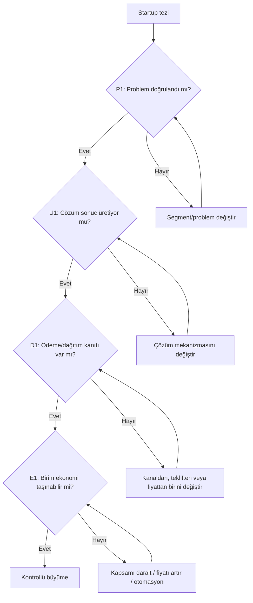

# Startup Karar Ağacı Şablonu

Bu şablon, uzun bir startup konuşmasını veya raporunu **katmanlı ve dallanan saf hareket planına** dönüştürmek için kullanılır.

## 1. Tek cümlelik tez

> **[Müşteri]**, **[problem]** nedeniyle **[ölçülebilir kayıp]** yaşıyor. Biz **[çözüm mekanizması]** ile **[ölçülebilir sonuç]** sağlayacağız ve müşteriye **[kanal]** üzerinden ulaşacağız.

## 2. Kuzey yıldızı

| Alan | Cevap |
|---|---|
| Hedef insan/kurum |  |
| Değiştirilecek sonuç |  |
| Başarı metriği |  |
| Zaman ufku |  |
| Neden şimdi? |  |

## 3. Kritik varsayımlar

Varsayımları “iyi fikir” biçiminde değil, yanlışlanabilir cümle olarak yaz.

| ID | Varsayım | Risk | Kanıt | Test | Eşik | Durum |
|---|---|---:|---|---|---|---|
| P1 |  | Yüksek |  |  |  | Açık |
| Ü1 |  | Yüksek |  |  |  | Açık |
| D1 |  | Yüksek |  |  |  | Açık |
| E1 |  | Orta |  |  |  | Açık |
| O1 |  | Orta |  |  |  | Açık |

## 4. Dallanan ana harita

Aşağıdaki düğümleri gerçek startup planına göre değiştir.

## 5. İnteraktif Markmap kaynağı

## 6. Saf hareket planı

Bir haftaya üçten fazla kritik hareket koyma.

| Öncelik | Hareket | Test edilen varsayım | Somut çıktı | Başarı eşiği | Sahip | Son tarih | Sonraki karar |
|---:|---|---|---|---|---|---|---|
| 1 |  |  |  |  |  |  |  |
| 2 |  |  |  |  |  |  |  |
| 3 |  |  |  |  |  |  |  |

## 7. Karar günlüğü

| Tarih | Yeni kanıt | Değişen varsayım | Karar | Açılan dal | Kapanan/dondurulan dal |
|---|---|---|---|---|---|
|  |  |  |  |  |  |

## 8. Son kontrol

- [ ] En riskli varsayım açıkça seçildi.
- [ ] Her hareket bir varsayımı test ediyor.
- [ ] Başarı ve başarısızlık eşikleri deneyden önce yazıldı.
- [ ] “Evet” ve “hayır” sonuçlarının açacağı dallar belli.
- [ ] Bekleyen işler ayrıca işaretlendi; aktif işlerle karışmıyor.
- [ ] Plan, mevcut kanıtlarla çelişmiyor.
- [ ] Kaynaklar ve sayılar korunuyor.
