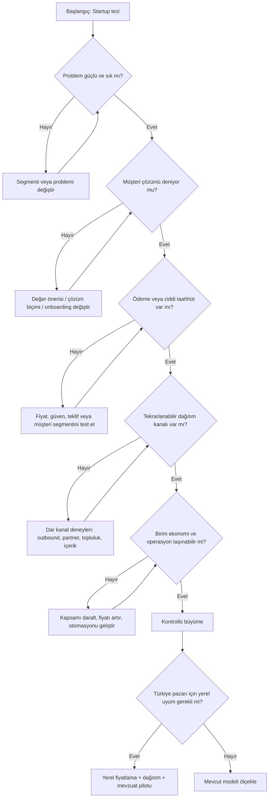

# Katmanlı Startup Hareket Planı

Bu sayfa startup planının **kuşbakışı kontrol merkezi**dir. Aşağıdaki yapı bilinçli olarak genel bırakıldı: mevcut ChatGPT konuşmasındaki gerçek startup planı işlendiğinde dallar, deneyler, tarihler ve eşikler somutlaştırılacak.

## 1. İnteraktif zihin haritası

!!! info "Haritayı kullanma şekli"
    Dalları aynı anda bitirmeye çalışma. En büyük riski taşıyan varsayımı seç; o varsayımı test eden yolu **aktif dal** yap. Diğer dallar görünür kalır ama bekler.

## 2. Karar kapılı ana akış

## 3. Paralel ama bağımlı iş akışları

=== "Keşif"

    - [ ] İlk ödeme ihtimali en yüksek segmenti seç
    - [ ] Görüşme sorularını hazırla
    - [ ] Problem sıklığı, şiddeti ve bugünkü maliyetini ölç
    - [ ] Karar eşiğini görüşmeler başlamadan yaz

=== "Ürün"

    - [ ] Sonucu sağlayan en küçük çözümü tanımla
    - [ ] Kod yazmadan test edilebilen kısmı ayır
    - [ ] Kullanıcı davranışı ve sonuç metriğini belirle
    - [ ] Başarısız deney sonrası hangi bileşenin değişeceğini yaz

=== "Satış"

    - [ ] İlk 100 müşteri adayının nerede olduğunu belirle
    - [ ] Tek bir kanal ve tek bir teklif ile başla
    - [ ] Görüşme → pilot → ödeme dönüşümünü izle
    - [ ] İtirazları kategori hâlinde kaydet

=== "Operasyon"

    - [ ] Pilot teslimatının gerçek maliyetini çıkar
    - [ ] Manuel iş yükünü ve darboğazı kaydet
    - [ ] Hukuk, veri, tahsilat ve destek risklerini sırala
    - [ ] Ölçeklemeden önce kırılacak ilk noktayı tahmin et

## 4. Aktif dal tablosu

GPT, gerçek planı işlerken bu tabloyu somut bilgilerle doldurmalıdır.

| Alan | Aktif cevap |
|---|---|
| Bu haftanın ana varsayımı | _Henüz işlenmedi_ |
| Neden en riskli varsayım bu? | _Henüz işlenmedi_ |
| En fazla üç hareket | _Henüz işlenmedi_ |
| Beklenen somut kanıt | _Henüz işlenmedi_ |
| Başarı eşiği | _Henüz işlenmedi_ |
| Başarısızlık eşiği | _Henüz işlenmedi_ |
| Sonraki açılacak dal | _Henüz işlenmedi_ |
| Dondurulan işler | _Henüz işlenmedi_ |

## 5. Planın kalite kontrolü

Bir hareket aşağıdakilerden hiçbirini değiştirmiyorsa muhtemelen gereksizdir:

- Müşteri hakkındaki kesinlik
- Problemin şiddeti hakkındaki kesinlik
- Çözümün işe yaradığına dair kanıt
- Ödeme isteğine dair kanıt
- Dağıtım kanalına dair kanıt
- Birim ekonomi veya operasyon kapasitesi
- Kritik risklerden birinin azalması

!!! danger "Sahte ilerleme sinyalleri"
    İsim bulmak, logo tasarlamak, genel pazar büyüklüğü okumak, kapsamı sürekli büyütmek ve ürün tamamlanmadan aylarca kod yazmak; bir karar kapısını açmıyorsa planın merkezine alınmamalıdır.
