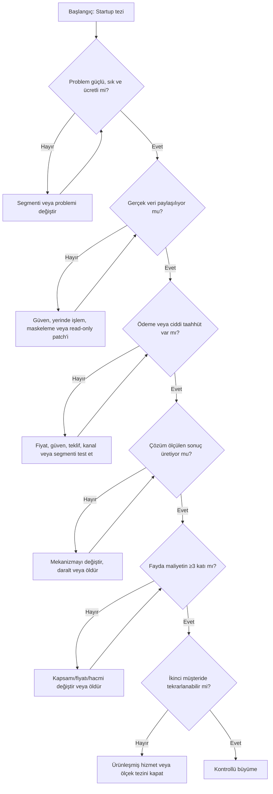

# Katmanlı Startup Hareket Planı

Bu sayfa bütün startup çalışmalarının **kuşbakışı kontrol merkezi**dir. Ayrıntılı aktif plan [Sipariş Operasyon Copilot'u karar ağacında](siparis-operasyon-copilotu/index.md) tutulur.

## 1. İnteraktif zihin haritası

!!! info "Haritayı kullanma şekli"
    Dalları aynı anda bitirme. En büyük belirsizliği taşıyan yolu **aktif dal** yap; diğer gerekli işler görünür kalır fakat bekler.

## 2. Karar kapılı ana akış

## 3. Paralel ama bağımlı iş akışları

=== "Problem–Müşteri"

    - Son 30 gün işlem hacmi görülmeden segment doğrulanmaz.
    - Son olay, kayıp ve bugünkü alternatif kaydedilir.
    - Gerçek dosya paylaşımı problem kanıtının parçasıdır.
    - Başarı sonucu çözüm testini açar.

=== "Çözüm–Ürün"

    - Koddan önce concierge ve shadow mode.
    - En fazla üç teslimat.
    - Human-in-the-loop ve kaynak gösterimi.
    - Ürün kapısı ödeme/veri sonrasında açılır.

=== "Dağıtım–Satış"

    - İlk 30 dar hedef.
    - Tek kanal/tek mesaj değil; kanal sonuçla değerlendirilir.
    - Görüşme → veri → teklif → depozito dönüşümü izlenir.
    - “Güzel fikir” taahhüt değildir.

=== "Ekonomi"

    - Pilot fiyatı hipotezdir.
    - Gerçek insan zamanı, hata ve kurucu saati ölçülür.
    - Fayda ≥3x değilse ölçek açılmaz.
    - İkinci müşteri pozitif katkı sağlamadan CAC/LTV yazılmaz.

=== "Operasyon–Risk"

    - Tek inbox, CSV-first ve shadow mode.
    - KVKK, veri minimizasyonu, tenant izolasyonu ve audit log.
    - Bypass ve destek yükü ölçülür.
    - İkinci müşteride ≥70 tekrar kullanım aranır.

=== "Türkiye'ye Giriş"

    - “Yerel ürün yok” varsayımı yasaktır.
    - Yerli rakip, ERP, entegratör, insan ve WhatsApp gerçek alternatiftir.
    - Yerel kama: dikey veri + ERP + dağıtım + sonuç.
    - Yalnız daha ucuz Türkçe kopya girilmez.

## 4. Aktif dal tablosu

| Alan | Aktif cevap |
|---|---|
| Bu haftanın ana varsayımı | Yüksek hacimli teknik distribütör gerçek dosya paylaşır ve ölçülen değer için ≥20.000 TL taahhüt verir |
| Neden en riskli? | Bu sonuç çıkmadan model, API, UI ve ölçek ekonomisi anlamsız |
| En fazla üç hareket | 30 hedef/ilk temas; 8–10 walkthrough + iki veri paketi; concierge + ücretli teklif |
| Beklenen somut kanıt | Hacim, son olay, 100+ satır, SKU, import şablonu, süre/hata baseline, depozito |
| Başarı eşiği | ≥1 ödeme + ≥2 veri paketi + ≥6 güçlü acı |
| Başarısızlık eşiği | 30 hedeften <3 veri paylaşımı veya 10 nitelikli teklifte sıfır ödeme |
| Sonraki açılacak dal | Shadow benchmark Ü1; sonra ERP writeback Ü2 |
| Dondurulan işler | Tam API, WhatsApp entegrasyonu, UI, marka, stok/fiyat otomasyonu ve diğer fırsat aileleri |

## 5. Aktif dosyaya geçiş

- [Ana karar ağacı](siparis-operasyon-copilotu/index.md)
- [Deneyler ve ölçüm](siparis-operasyon-copilotu/deneyler.md)
- [Karar günlüğü](siparis-operasyon-copilotu/karar-gunlugu.md)

## 6. Planın kalite kontrolü

Bir hareket aşağıdakilerden hiçbirini değiştirmiyorsa muhtemelen gereksizdir:

- müşteri hakkındaki kesinlik,
- problemin şiddeti,
- veri paylaşma isteği,
- çözümün ölçülen sonucu,
- ödeme isteği,
- dağıtım kanalı,
- birim ekonomi,
- operasyon kapasitesi,
- kritik risklerden biri.

!!! danger "Sahte ilerleme sinyalleri"
    İsim bulmak, logo tasarlamak, genel pazar büyüklüğü okumak, kapsamı sürekli büyütmek ve ürün tamamlanmadan aylarca kod yazmak; bir karar kapısını açmıyorsa planın merkezine alınmaz.
