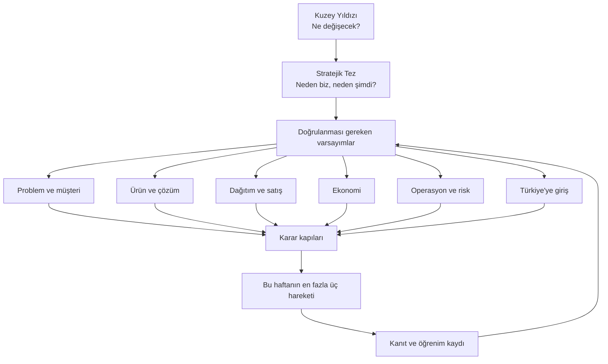

# Startup Merkezi

Bu bölüm, startup hakkındaki bütün düşünceleri tek bir **hareket sistemi** altında toplar. Amaç daha fazla analiz üretmek değil; belirsizliği azaltan sıradaki deneyi seçmektir.

## Aktif çalışma: Sipariş Operasyon Copilot'u

**Aktif dal:** Yüksek hacimli teknik distribütörün gerçek sipariş dosyasını paylaşması ve ölçülen değer için ücretli diagnostic/pilot taahhüdü vermesi.

**Bu hafta:** 30 dar hedef → 8–10 geçmiş davranış görüşmesi → iki gerçek veri paketi → concierge sonuç gösterimi → en az 20.000 TL depozito kapısı.

[Karar ağacını aç](siparis-operasyon-copilotu/index.md){ .md-button .md-button--primary }

## Yönetim katmanları

## Her bilgi hangi seviyeye yazılmalı?

| Katman | İçerik | Sürekli değişir mi? |
|---|---|---|
| Kuzey yıldızı | Startup'ın kurulduğunda yaratacağı sonuç | Nadiren |
| Stratejik tez | Neden bu problem, müşteri, çözüm ve zamanlama | Kontrollü biçimde |
| Kanıtlar/bilinmeyenler | Bugün bildiğimiz ve hâlâ varsaydığımız şeyler | Sürekli |
| Varsayımlar | İşin doğru olması için doğru çıkması gerekenler | Evet |
| Karar kapıları | Devam, pivot, bekle veya dur ölçütleri | Deney öncesinde sabitlenir |
| Dallar | Farklı deney sonuçlarında açılacak yollar | Kanıta göre |
| Hareketler | Görüşme, prototip, satış ve deney işleri | Her hafta; en fazla üç kritik hareket |
| Kanıtlar | Sayılar, görüşmeler, kaynaklar ve deney sonuçları | Sürekli birikir |

## Aktif startup sayfaları

-   :material-source-branch: **Ana Karar Ağacı**

    Kuzey yıldızı, kritik varsayımlar, Mermaid, Markmap, aktif/dondurulan dallar ve haftalık üç hareket.

    [Aç](siparis-operasyon-copilotu/index.md)

-   :material-account-search: **Pazar ve Müşteri**

    İlk fenotip, organik problem, küresel sinyaller, Türkiye rakipleri ve karşı-tezler.

    [Aç](siparis-operasyon-copilotu/pazar.md)

-   :material-cube-outline: **Ürün ve Çözüm**

    Shadow mode, exception motoru, ERP entegrasyon dalları, KVKK ve ürün öldürme kriterleri.

    [Aç](siparis-operasyon-copilotu/urun.md)

-   :material-bullhorn-outline: **Dağıtım ve Satış**

    İlk 30 kişi, görüşme soruları, gerçek dosya talebi, teklif ve ödeme kapıları.

    [Aç](siparis-operasyon-copilotu/satis.md)

-   :material-calculator-variant-outline: **Ekonomi**

    Fiyat hipotezi, ROI, teslim maliyeti, kur riski ve birim ekonomi kapıları.

    [Aç](siparis-operasyon-copilotu/ekonomi.md)

-   :material-flask-outline: **Deneyler**

    Dosya testi, concierge diagnostic, shadow pilot, ölçüm şeması ve sonuç dalları.

    [Aç](siparis-operasyon-copilotu/deneyler.md)

-   :material-notebook-check-outline: **Karar Günlüğü**

    Aday skorları, çelişki çözümü, dondurulan işler ve tarihli öğrenim kayıtları.

    [Aç](siparis-operasyon-copilotu/karar-gunlugu.md)

-   :material-radar: **Kanıt Radarı**

    25+ küresel şirket/kategori, 14 Türkiye fırsat ailesi, altı güçlü aday, simülasyonlar ve kaynak arşivi.

    [Aç](siparis-operasyon-copilotu/kanit-radari.md)

## Ana çalışma kuralı

!!! warning "Görev listesi ile stratejiyi karıştırma"
    “Logo yap”, “şirket aç”, “site kur” veya “genel AI araştırması yap” gibi görevler tek başına ilerleme değildir. Her hareketin hangi varsayımı test ettiği ve hangi kararı mümkün kıldığı açıkça yazılmalıdır.

Bir hareket ancak aşağıdaki alanları içeriyorsa plana alınır:

1. **Test edilen varsayım**
2. **Neden şimdi?**
3. **Somut çıktı**
4. **Başarı ve başarısızlık eşiği**
5. **Sahip ve son tarih**
6. **Sonuca göre açılacak sonraki dal**

[Katmanlı hareket sistemine geç](hareket-plani.md){ .md-button }
