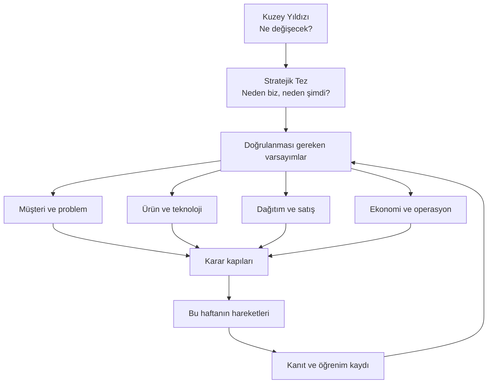

# Startup Merkezi

Bu bölüm, startup hakkındaki bütün düşünceleri tek bir **hareket sistemi** altında toplar. Amaç daha fazla analiz üretmek değil; belirsizliği azaltan sıradaki deneyi seçmektir.

## Yönetim katmanları

## Her bilgi hangi seviyeye yazılmalı?

| Katman | İçerik | Sürekli değişir mi? |
|---|---|---|
| Kuzey yıldızı | Startup'ın kurulduğunda yaratacağı sonuç | Nadiren |
| Stratejik tez | Neden bu problem, müşteri, çözüm ve zamanlama | Kontrollü biçimde |
| Varsayımlar | İşin doğru olması için doğru çıkması gerekenler | Evet |
| Karar kapıları | Devam, pivot, bekle veya dur ölçütleri | Deney öncesinde sabitlenir |
| Hareketler | Görüşme, prototip, satış, deney ve operasyon işleri | Her hafta |
| Kanıtlar | Sayılar, görüşmeler, kaynaklar ve deney sonuçları | Sürekli birikir |

## Ana çalışma kuralı

!!! warning "Görev listesi ile stratejiyi karıştırma"
    “Logo yap”, “şirket aç” veya “site kur” gibi görevler tek başına ilerleme değildir. Her hareketin hangi varsayımı test ettiği ve hangi kararı mümkün kıldığı açıkça yazılmalıdır.

Bir hareket ancak aşağıdaki beş alanı içeriyorsa plana alınır:

1. **Amaç:** Hangi belirsizliği azaltıyor?
2. **Somut çıktı:** İş bittiğinde elde ne olacak?
3. **Ölçüt:** Başarı veya başarısızlık nasıl anlaşılacak?
4. **Sahip ve zaman:** Kim, ne zamana kadar?
5. **Sonraki karar:** Sonuç hangi dalı açacak veya kapatacak?

[Katmanlı hareket planına geç](hareket-plani.md){ .md-button .md-button--primary }
