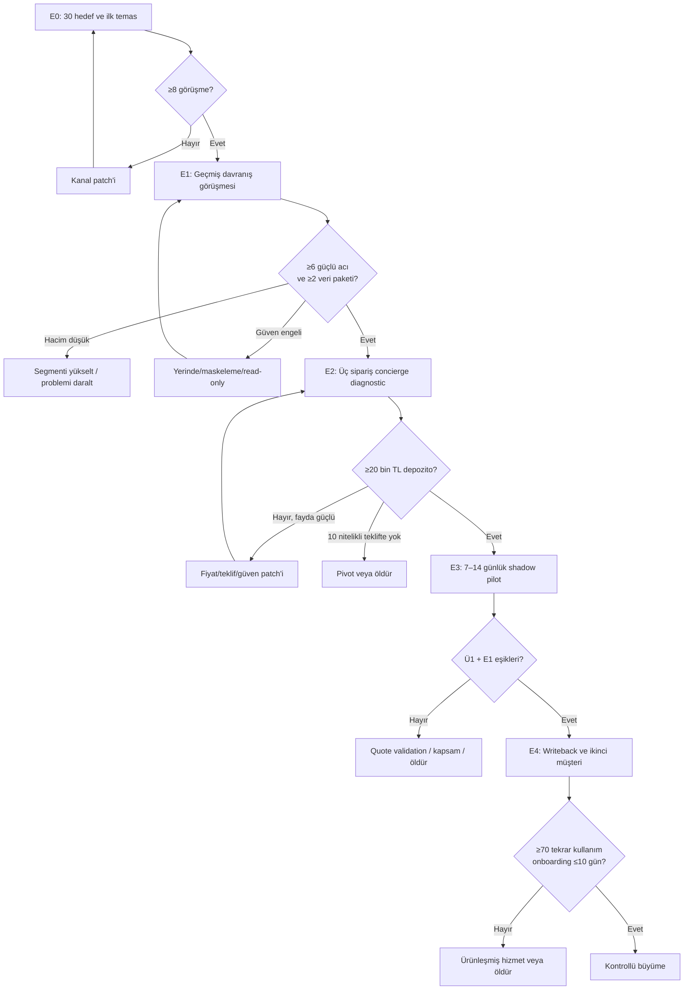

# Deneyler ve Ölçüm Planı

> **Ana deney ilkesi:** Kullanım niyeti değil, geçmiş davranış + gerçek dosya + ölçülen sonuç + para taahhüdü aranır.

[← Ana karar ağacı](index.md)

## 1. Deney sırası ve bağımlılık

## 2. Deney 0 — 30 hedef ve erişim testi

### Test edilen varsayımlar

- **D0:** Hedef fenotipe mevcut çevre ve dar outbound ile ulaşılabilir.
- **P1 ön sinyali:** Hedeflerde yeterli işlem hacmi vardır.

### Neden şimdi?

Görüşme ve dosya erişimi olmadan ürün, pazar ve entegrasyon çalışması karar üretmez.

### Uygulama

- 30 şirketlik hedef matrisi oluştur.
- İlk 15 karar vericiye kişiselleştirilmiş görüşme talebi gönder.
- Mesajda ürün demosu değil “son beş sipariş walkthrough'u” ve üç siparişlik diagnostic anlat.
- ERP, sektör, çalışan, hacim, karar verici, kanal ve satın alma tetikleyicisini kaydet.

### Somut çıktı

- 30 satırlık hedef matrisi,
- 15 gönderilmiş mesaj/arama,
- randevular,
- ilk itiraz kategorileri.

### Eşikler

| Sonuç | Karar |
|---|---|
| ≥8 görüşme | Deney 1'e geç |
| 3–7 görüşme | Mesaj ve kanal ayrıştır; ERP bayisi/referans/yüz yüze dalı |
| ≤2 görüşme | Mevcut kanal tezi başarısız; hedef/kanal değişmeden ürün yapma |

**Sahip:** Faruk  
**Son tarih:** 2026-08-07

## 3. Deney 1 — Geçmiş davranış ve dosya testi

### Test edilen varsayımlar

- **P1:** Problem güçlü, sık ve son olaylarla görünür.
- **P2:** Şirket veri paylaşır.
- **T1:** Mevcut ERP/portal/entegratör aynı dar açığı bırakır.
- **R1:** Güven ve KVKK shadow diagnostic için yönetilebilir.

### Görüşme örneklemi

- 10 sahip/GM,
- 8 satış/operasyon müdürü,
- 8 günlük kullanıcı,
- 4 ERP bayisi/entegratörü.

İlk hafta hedefi 8–10 görüşmedir; 30 kişi bütün discovery havuzudur.

### Sorular

- Dün gelen son beş sipariş hangi kanallardan geldi?
- Son sipariş ERP'ye kaç dakikada girdi?
- Geçen ay yanlış ürün/miktar/birim/fiyat veya kaçırılan sipariş oldu mu?
- Son hatanın operasyon ve müşteri etkisi neydi?
- Sipariş personeli yarın ayrılsa ne kırılır?
- Müşteri kodu ile SKU nasıl eşleşiyor?
- Paket/koli/adet kuralları nerede tutuluyor?
- Portal dışı sipariş oranı nedir ve neden devam ediyor?
- Son 12 ayda çalışan, entegratör, yazılım veya danışmana ne ödendi?
- Bu işlem için gerçek dosya ve import şablonu paylaşmanın engeli nedir?

### İstenecek veri

- son 20 sipariş e-postası veya temizlenmiş export,
- en az beş PDF/Excel,
- toplam ≥100 sipariş satırı,
- SKU ana listesi,
- varsa müşteri kodu eşleştirmesi,
- ERP import şablonu,
- hatalı/gecikmiş sipariş kaydı,
- kullanılan Excel/not listesi.

### Somut çıktı

- görüşme notları ve geçmiş olay tablosu,
- hacim/süre/hata baseline,
- en az iki veri paketi,
- mevcut çözüm açıkları,
- veri işleme koşulları,
- P1/P2/T1/R1 kapı kararı.

### Eşikler

**Başarı:**

- 8–10 görüşmenin ≥6'sında güçlü ve tekrarlanan acı,
- ≥5 şirkette son 90 günden somut olay,
- ≥2 şirketten veri paketi,
- en az iki şirketin ürün/portal/entegratör sonrası aynı dar açığı.

**Başarısızlık:**

- ≤2 güçlü acı,
- hedeflerin çoğu <20 sipariş/gün,
- portal dışı sipariş payı önemsiz,
- güven patch'lerine rağmen hiç veri paylaşımı yok.

### Sonuç dalları

| Sonuç | Sonraki dal |
|---|---|
| Güçlü acı + veri | Deney 2 |
| Acı güçlü, veri güven nedeniyle yok | Yerinde işleme + maskeleme + DPA ile bir tekrar |
| Acı güçlü, asıl sorun fiyat/stok | Quote/order validation veya marj leakage |
| Hacim düşük | Daha yüksek hacimli segment |
| Mevcut çözüm yeterli | Genel order-entry dondur |
| Acı zayıf | Sipariş tezi öldür |

**Sahip:** Faruk  
**Son tarih:** 2026-08-08

## 4. Deney 2 — Üç siparişlik concierge diagnostic ve teklif

### Test edilen varsayımlar

- **D1:** Gerçek ödeme isteği var.
- **Ü1 ön sinyali:** Manuel + Python/LLM ile hız ve doğruluk üretilebilir.
- **E1 ön sinyali:** Fayda fiyatı savunabilir.

### Uygulama

1. Müşterinin üç gerçek siparişini mevcut yöntemle zamanla.
2. Aynı siparişi manuel + Python/LLM destekli yapılandırılmış tabloya dönüştür.
3. Her alanın kaynak satırını göster.
4. Müşteri/SKU/miktar/birim/fiyat için confidence ekle.
5. Exception ve geri soru listesini çıkar.
6. Onaylı ERP import dosyasını hazırla; canlı writeback yapma.
7. Önce/sonra dakika ve doğruluk farkını müşteriyle doğrula.
8. 20–25 bin TL diagnostic veya 45 bin TL/14 gün shadow pilot teklif et.
9. ≥20 bin TL depozito veya imzalı/tarihli pilot iste.

### Somut çıktı

- üç siparişlik kaynaklı çıktı,
- exception listesi,
- süre ölçümü,
- hata/geri soru karşılaştırması,
- basit ROI tablosu,
- yazılı teklif,
- müşterinin gerçek taahhüdü veya red nedeni.

### Eşikler

**Başarı:**

- örnekte ≥%60 süre azalması,
- kritik hata yok veya <%2 sinyali,
- müşteri ölçümü kabul ediyor,
- ≥1 müşteri ≥20.000 TL depozito veya imzalı ücretli pilot veriyor.

**Başarısızlık:**

- nitelikli acı ve gösterilmiş faydaya rağmen 10 teklifte sıfır ödeme,
- veri sahiplerinin tamamı ödeme yerine ücretsiz deneme istiyor,
- üç örnekte dahi sürekli yoğun yorum gerekiyor,
- ekonomik etki ücretin <1,5 katına işaret ediyor.

### Sonuç dalları

- **Ödeme:** Deney 3.
- **ROI güçlü, ödeme yok:** fiyat, güven, karar verici veya teklif patch'i; tek tur.
- **Extraction iyi, asıl değer doğrulama:** quote/order validation pivotu.
- **ROI zayıf:** sipariş girişini öldür; marj leakage veya başka dal ancak kendi kanıtıyla açılır.

**Sahip:** Faruk  
**Son tarih:** 2026-08-09

## 5. Deney 3 — Tek inbox shadow pilot

### Ön koşullar

- P1, P2 ve D1 geçti.
- Veri işleme sınırları yazılı.
- Süreç sahibi atandı.
- Pilot ücretinin en az %50'si tahsil edildi.
- Tek inbox ve kapsam sözleşmede.

### Süre

7–14 gün. İlk karar yedinci gün; gerekirse doğruluk ve hacim için 14 güne tamamlanır.

### Akış

1. `siparis@...` gibi tek kanal seçilir.
2. Gelen siparişler mevcut çalışanla paralel işlenir.
3. Müşteri, ürün, miktar, birim, fiyat ve not çıkarılır.
4. Sistem önerisi çalışan girişiyle karşılaştırılır.
5. Düşük güvenli satırlar exception kuyruğuna düşer.
6. Düzeltmeler neden koduyla alias/kural hafızasına eklenir.
7. Gün sonunda onaylı ERP import dosyası verilir.
8. Canlı writeback yapılmaz.

### Ölçüm şeması

| Metrik | Tanım |
|---|---|
| Mevcut dakika | Siparişin açılmasından ERP kaydına kadar aktif insan zamanı |
| Yeni dakika | Review + exception + import hazırlama insan zamanı |
| Satır doğruluğu | Tüm alanları doğru çıkan satır / toplam satır |
| Kritik hata | Yanlış müşteri/SKU/miktar/birim/fiyatın onaylı çıktıya geçmesi |
| Hızlı onay | Düzenleme gerektirmeyen veya saniyelik onaylanan satır |
| Exception oranı | Manuel incelemeye düşen satır |
| Tekrar kullanılan alias | Önceki düzeltmeyle otomatik çözülen yeni satır |
| Geri soru | Müşteriye açıklama için dönülen sipariş |
| Bypass | Seçili kanala girmeden yürütülen sipariş |
| Kurucu zamanı | Onboarding, geliştirme, operasyon ve destek ayrı |

### Başarı

- ≥100 gerçek satır,
- satır doğruluğu ≥%90,
- hızlı onay >%70,
- kritik hata <%2,
- insan süresi >%60 azalır,
- müşteri canlı entegrasyon/ikinci dönem için ödeme yapar.

### Kısmi sonuç

| Gözlem | Patch |
|---|---|
| Extraction güçlü, SKU zayıf | Daha dar ürün ailesi; alias onboarding |
| SKU güçlü, fiyat/stok ana sorun | Quote/order validation |
| Hızlı onay düşük ama tekrar arttıkça iyileşiyor | Pilot uzatılmaz; yalnız öğrenme eğrisi netse ikinci veri partisi |
| Çalışan bypass ediyor | Süreç sahibi, tek kanal ve teşvik tasarımı |
| API kapalı | CSV-only ürün + ERP partneri |

### Öldürme

- insan gözetimiyle bile doğruluk %90'a çıkmıyor,
- kritik hata ≥%2 ve güven eşikleriyle düşmüyor,
- satırların >%50'si kalıcı insan yorumu istiyor,
- her müşteri için yeni veri modeli gerekiyor,
- ölçülen faydaya rağmen ikinci ödeme yok.

## 6. Deney 4 — Writeback ve ikinci müşteri

### Ü2 testi

- gerçek ERP ürünü/sürümü,
- lisans ve yetki,
- standart CSV/import,
- test veritabanı,
- Mikro API veya Logo/entegratör yolu,
- rollback ve audit.

### O1 testi

Aynı dikeyde ikinci müşteride:

- ≥70 kod/kural yeniden kullanımı,
- onboarding ≤10 iş günü,
- özel geliştirmenin toplam işin <30'u,
- pozitif brüt katkı,
- kurucunun günlük manuel operatör olmaması.

### Sonuç

- **Geçer:** kontrollü büyüme ve ilk 100 kanal deneyi.
- **Kısmi:** tek dikey premium ürünleşmiş hizmet.
- **Kalır:** ölçeklenebilir startup tezi öldürülür.

## 7. Görüşme ve deney kayıt şablonu

| Tarih | Şirket/rol | Hacim | Son olay | Mevcut çözüm | Dosya paylaştı mı? | Süre/hata | Teklif | Para/taahhüt | Açılan dal |
|---|---|---:|---|---|---|---|---|---|---|
|  |  |  |  |  |  |  |  |  |  |

## 8. Haftalık karar ritmi

Her pazar akşamı yalnız şu dört karardan biri yazılır:

- **Devam:** eşik geçti, sonraki dal açıldı.
- **Patch:** tek bir açıklanabilir engel var; bir deney turu daha.
- **Pivot:** problem/segment/çözüm mekanizması değişti.
- **Öldür/Bekle:** ödeme, veri, ekonomi veya operasyon engeli temel tezi bozdu.

Aynı başarısız kapıya üçten fazla büyük patch yapılmaz. Üç büyük patch, özel danışmanlık veya tez yanlışı sinyalidir.
