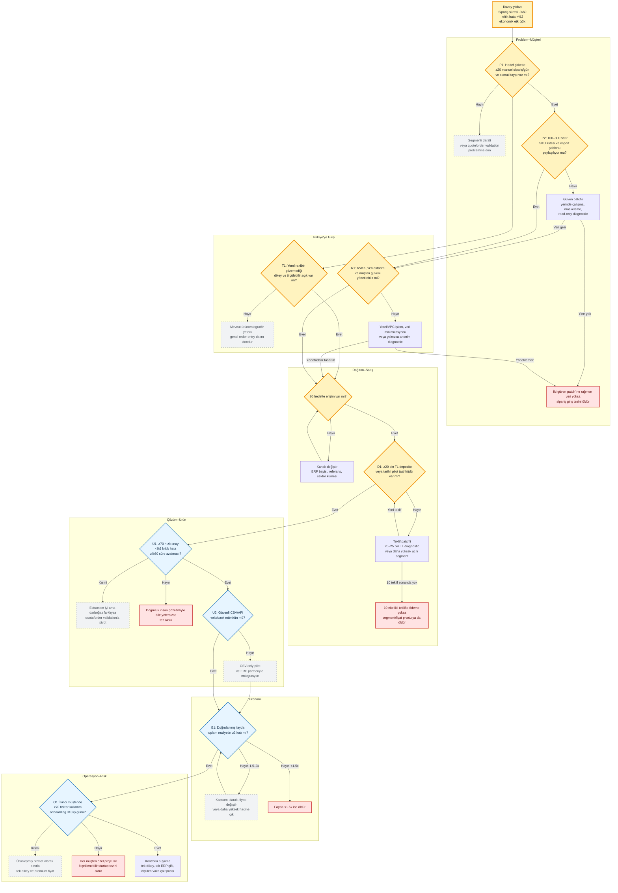

# Sipariş Operasyon Copilot'u — Ana Karar Ağacı

> **Karar:** Koşullu girilir; ürün geliştirme değil, ücretli kanıt kapısı aktiftir.  
> **Aktif dal:** Yüksek hacimli teknik distribütörün gerçek sipariş dosyasını paylaşması ve ölçülen değer karşılığında ücretli diagnostic/pilot taahhüdü vermesi.  
> **Sahip:** Faruk  
> **Son güncelleme:** 2026-08-05  
> **Sıradaki karar tarihi:** 2026-08-09

## Kuzey yıldızı

**Logo veya Mikro kullanan teknik distribütörlerde, müşterinin kanalını değiştirmeden gelen siparişi güvenli biçimde ERP'ye hazır hâle getirerek işlem süresini en az %60 azaltmak; kritik sipariş hatasını %2'nin altında tutmak ve müşteriye ürün maliyetinin en az üç katı doğrulanmış ekonomik etki üretmek.**

## 30 saniyelik sonuç

Son 36 ayın güçlü küresel sinyali, mevcut yazılıma bir AI düğmesi eklemek değil; daha önce çalışanın yürüttüğü süreci e-posta, PDF, Excel veya konuşmadan başlayıp karar ve kayıt sistemi güncellemesine kadar üstlenen **dikey operasyon sistemleri**dir. Comena, Distro, Ventura ve Mercura'nın distribütörlerde teklif ve sipariş girişine yönelmesi; HappyRobot'ın parçalı kurumsal operasyonları ajanlarla yürütmesi bu yönü destekliyor.

Türkiye'deki fırsat “yabancı order-entry ürününün Türkçe kopyası” değildir. ArisaiSoft gibi yerli oyuncular PDF, e-posta, Excel ve WhatsApp'tan ERP'ye AI veri aktarımını zaten sunuyor. Dolayısıyla savunulabilir kama ancak şu bileşimden doğabilir:

- tek bir teknik dağıtım dikeyi,
- Logo/Mikro entegrasyon şablonları,
- müşteri–SKU eş anlamlılar grafiği,
- koli–adet–paket ve müşteri özel fiyat kuralları,
- confidence tabanlı istisna kuyruğu,
- insan onaylı writeback ve audit log,
- ölçülen sonuç üzerinden satış.

Şu anda en büyük bilinmeyen model doğruluğu değildir. **Yeterli işlem hacmine sahip şirketlerin gerçek veri paylaşması ve ölçülen sonuç için ödeme yapmasıdır.** Bu nedenle isim, logo, genel site, canlı WhatsApp entegrasyonu ve tam ERP writeback aktif iş değildir.

## Tek cümlelik startup tezi

> **Logo veya Mikro kullanan, günde en az 20 manuel sipariş alan teknik distribütör**, PDF/Excel/e-posta/WhatsApp siparişlerini ERP'ye yeniden girerken zaman, kapasite ve hata kaybı yaşıyor. Biz **müşteri–SKU eşleştirmesi, paket kuralları ve insan onaylı istisna yönetimi** ile siparişleri ERP importuna hazırlayacağız; ilk müşteriye **ERP bayileri ve İstanbul teknik ticaret kümeleri** üzerinden ulaşacağız.

## 1. Kuzey yıldızı

| Alan | Karar |
|---|---|
| Hedef kurum | İstanbul'da HVAC, elektrik malzemesi veya endüstriyel yedek parça satan; 15–60 çalışanlı; 2.000+ SKU'lu; Logo veya Mikro kullanan distribütör |
| Değiştirilecek sonuç | Siparişin gelişinden ERP'ye onaylı kayda kadar geçen insan süresi ve kritik hata oranı |
| Ana başarı metrikleri | ≥%60 zaman azalması; <%2 kritik ürün/miktar/fiyat hatası; ≥%70 hızlı onay oranı |
| Ekonomik başarı | Doğrulanmış yıllık fayda toplam ürün maliyetinin ≥3 katı |
| İlk değer süresi | 3–7 günde diagnostic; 14 günde ücretli shadow pilot |
| 30–45 günlük hedef | Bir ücretli pilot, ikinci ödeme ve ikinci müşteride ≥%70 kod/kural yeniden kullanımı |
| Neden şimdi? | Belge anlama ve ürün eşleştirme ucuzladı; küresel girişimler inbox-to-ERP kategorisini doğruluyor; Mikro'nun resmî API'si ve Logo'nun üçüncü taraf entegrasyon altyapısı writeback olasılığını destekliyor |

## 2. Mevcut kanıtlar ve bilinmeyenler

| Kol | Mevcut kanıt | Kritik bilinmeyen | Şimdiki hüküm |
|---|---|---|---|
| **Problem–müşteri** | Türkiye'deki sipariş/operasyon ilanları manuel ERP aktarımı, fiyat–stok–kredi kontrolü ve sipariş takibi için çalışan bütçesi bulunduğunu gösteriyor. Yerel sağlayıcılar telefon/WhatsApp → Excel/ERP akışını ve koli–adet hatasını tarif ediyor. | Hedef fenotipte gerçek günlük hacim, sipariş başına dakika, hata sıklığı ve son 12 ayda ödenen çözüm bütçesi | **Aktif:** gerçek dosya ve geçmiş davranışla doğrulanacak |
| **Çözüm–ürün** | Comena inbox-to-ERP, SKU matching ve human-in-the-loop modelini aktif biçimde sunuyor. Türkiye'de ArisaiSoft aynı veri kaynaklarını ERP'ye aktaran doğrudan bir sinyal. | 100–300 gerçek satırda ≥%70 hızlı onay, <%2 kritik hata ve ≥%60 süre azalması mümkün mü? | Veri gelmeden ürün kodlama donduruldu |
| **Dağıtım–satış** | Kurucunun HVAC/teknik servis çevresi, Logo/Mikro bayileri ve İstanbul teknik ticaret kümeleri somut erişim kanalı. | 30 hedeften kaç tanesi görüşme, dosya paylaşımı ve ≥20.000 TL depozitoya dönüşecek? | **Aktif:** ödeme ve veri paylaşımı aynı kapıda test edilecek |
| **Ekonomi** | Personel zamanı, fazla mesai, yanlış sevkiyat, iade ve kaybedilen sipariş mevcut bütçedir. Pilot hipotezi 45.000 TL/14 gün; daha dar diagnostic 20–25 bin TL. | Ölçülen ekonomik etki ücretin ≥3 katına çıkıyor mu; onboarding saati marjı yiyor mu? | Saha verisi olmadan CAC/LTV üretilmeyecek |
| **Operasyon–risk** | Shadow mode, confidence threshold, insan onayı ve CSV ile canlı sisteme risk vermeden başlanabilir. | Veri paylaşımı, ERP erişimi, çalışan bypass'ı ve her müşteride özel proje riski | İlk pilot tek inbox ve read-only/shadow mode ile sınırlandı |
| **Türkiye'ye giriş** | “Türkiye'de ürün yok” tezi yanlış; yerli AI belge işleme, bayi portalları ve entegratörler var. Yerel avantaj dil + ERP + dikey veri + sonuç hizmetidir. | Yerel rakibin çözemediği dar segment gerçekten var mı; ERP bayisi ortak mı engel mi olacak? | A değil, **B/E boşluğu:** çözüm var ama dikey sonuç katmanı test edilebilir |

Detaylı pazar kanıtı ve bütün alternatif fırsatlar [Küresel Sinyal ve Türkiye Kanıt Radarı](kanit-radari.md) sayfasında korunur.

## 3. Kritik varsayımlar

| ID | Yanlışlanabilir varsayım | Risk | Mevcut kanıt | Test | Başarı eşiği | Başarısızlık eşiği | Durum |
|---|---|---:|---|---|---|---|---|
| **P1** | Hedef fenotip günde en az 20 manuel sipariş alıyor ve bu iş düzenli kapasite/hata kaybı yaratıyor. | Çok yüksek | İş ilanları ve yerel süreç anlatıları | Son 30 gün sipariş hacmi ve son beş sipariş walkthrough'u | 10 nitelikli görüşmenin ≥6'sında eşik üstü hacim ve somut son olay | ≤2 şirkette eşik üstü hacim | **Aktif** |
| **P2** | Müşteri en az 100 tarihî sipariş satırı, SKU listesi ve ERP import şablonu paylaşır. | Çok yüksek | Henüz yok | Veri paylaşım talebi + basit DPA/maskeleme seçeneği | 30 hedeften ≥3 veri paylaşımı; bu hafta ≥2 | 30 hedeften <3 veya görüşenlerin tamamı reddeder | **Aktif** |
| **D1** | Ölçülen probleme sahip müşteri diagnostic/pilot için gerçek para taahhüt eder. | Çok yüksek | Henüz yok | 20–25 bin TL diagnostic veya 45 bin TL/14 gün pilot teklifi | En az bir ≥20.000 TL depozito veya imzalı, tarihli pilot siparişi | 10 nitelikli teklifte sıfır ödeme/taahhüt | **Aktif** |
| **Ü1** | Gerçek siparişlerin ≥%70'i kısa insan onayıyla işlenir; kritik hata <%2 olur. | Yüksek | Küresel şirket iddiaları; Türkiye verisi yok | 100–300 satırlık shadow benchmark | ≥%70 hızlı onay, <%2 kritik hata, satır doğruluğu ≥%90 | >%50 sürekli insan yorumu veya kritik hata ≥%2 | P2 ve D1 sonrası açılır |
| **Ü2** | Müşterinin ERP'sini değiştirmeden CSV veya API writeback mümkündür. | Yüksek | Mikro resmî REST API ve kayıt endpoint'leri; Logo üçüncü taraf entegrasyonu/çift yönlü veri paylaşımı sunuyor | Gerçek sürüm, lisans ve import yöntemi teknik keşfi | İlk müşteride onaylı CSV; ikinci aşamada kontrollü API/entegratör yolu | Sürüm/lisans nedeniyle güvenli import yok veya bayi erişimi engelliyor | Ü1 sonrası açılır |
| **E1** | Ürün müşteriye toplam maliyetinin en az üç katı ekonomik etki sağlar. | Yüksek | Mevcut çalışan bütçesi var; yerel fayda büyüklüğü yok | Önce/sonra dakika, hata, yeniden sevkiyat ve kapasite hesabı | Yıllıklaştırılmış doğrulanmış fayda / toplam maliyet ≥3 | Oran <1,5 veya müşteri faydayı onaylamıyor | Ü1 sonrası açılır |
| **O1** | Çözüm ikinci müşteride özel projeye dönüşmeden tekrar kullanılabilir. | Yüksek | Kurucu becerileri uyumlu; ikinci müşteri kanıtı yok | Aynı dikeyde ikinci shadow pilot | Kod/kuralın ≥%70'i yeniden kullanılır; onboarding ≤10 iş günü | Kodun >%50'si yeniden yazılır veya onboarding >2 hafta | İlk pilot sonrası açılır |
| **R1** | Sipariş verisi KVKK ve müşteri güveniyle uyumlu biçimde işlenebilir. | Yüksek | Shadow mode ve yerinde/yerel işleme seçenekleri; KVKK yurt dışı aktarım mekanizmaları mevcut | Veri haritası, maskeleme, saklama süresi ve DPA | Müşteri yazılı onay verir; gereksiz kişisel veri işlenmez; aktarım yolu kayıtlıdır | Veri amacı/saklama/aktarım açıklanamıyor veya müşteri onaylamıyor | P2 ile paralel |
| **T1** | Yerel dikey kama, ArisaiSoft/ERP entegratörü/bayi portalından anlamlı biçimde ayrışır. | Orta-yüksek | Doğrudan yerli rakip var; dar sektör ve sonuç metriği henüz test edilmedi | Kayıp nedenleri ve rakip kullanım görüşmesi | ≥5 görüşmede mevcut çözümün aynı somut açığı; en az 2'si pilot isteği | Mevcut çözüm aynı sonucu kabul edilebilir fiyatla veriyor | P1 ile paralel |

## 4. Dallanan ana karar akışı

## 5. İnteraktif Markmap

## 6. Aktif dal

| Alan | Aktif cevap |
|---|---|
| Ana belirsizlik | Hedef şirket gerçek dosyayı paylaşacak ve ölçülen değer için ödeme yapacak mı? |
| Neden önce bu? | Bu sonuç çıkmadan model doğruluğu, API entegrasyonu ve ürün mimarisi ekonomik olarak anlamsızdır. |
| Bağlanan kollar | Problem–müşteri **P1/P2** → Türkiye kama/güven **T1/R1** → dağıtım–satış **D0/D1** |
| Beklenen somut kanıt | Son 30 gün hacmi; son beş sipariş walkthrough'u; 100+ gerçek satır; SKU listesi; ERP import şablonu; ≥20 bin TL depozito |
| Başarı | Bir ödeme + iki veri paylaşan şirket + en az altı yüksek hacimli problem doğrulaması |
| Başarısızlık | 30 hedeften <3 veri paylaşımı veya 10 nitelikli teklifte sıfır ödeme |
| Başarı sonrası açılan dal | Ü1 shadow benchmark ve ardından Ü2 writeback |
| Başarısızlık sonrası açılan dal | Önce kanal/güven patch'i; sonra quote/order validation veya marj leakage pivotu; eşikler yine geçilmezse öldür |

## 7. Dondurulan ve öldürülen dallar

### Dondurulan — kanıt çıkarsa yeniden açılabilir

| Dal | Neden şimdi donduruldu? | Yeniden açma koşulu |
|---|---|---|
| Tam Logo/Mikro API writeback | Veri ve ödeme kanıtı yok; önce CSV/shadow yeterli | D1 ve Ü1 geçilir; müşteri sürümü ve lisansı doğrulanır |
| Canlı WhatsApp Business entegrasyonu | Kanal entegrasyonu ürün değerinden önce gereksiz karmaşıklık | Pilotların anlamlı payı WhatsApp'tan gelir ve export yetersiz kalır |
| Stok/fiyat doğrulama | İlk ürün kapsamını büyütür | Extraction iyi fakat görüşmeler ana darboğazın stok/fiyat olduğunu gösterir |
| Tahsilat exception desk | Problem kanıtı daha güçlü ve 85 puan; yerel reminder rekabeti ile ilişki riski daha yüksek | Sipariş tezi veri/ödeme kapısında ölür veya aynı müşteriler tahsilatı daha acil gösterir |
| Marj leakage guardrail | 81 puan ve kurucu uyumu güçlü; veri kalitesi/ödeme kanıtı zayıf | Sipariş verisi bulunur fakat asıl kayıp yanlış fiyat/iskonto çıkar |
| Freight audit | Alan uzmanı ve güven kanalı eksik | Lojistik maliyet ortağı ve aylık ≥3M TL navlun harcayan müşteri bulunur |
| EKAP final-QA | Yerli ürünler var; danışman kanalına ihtiyaç var | Düzenli ihale müşterisi ve tekrar kullanılan kanıt arşivi bulunur |
| Security questionnaire desk | Anket sıklığı ve yerel ödeme bilinmiyor; uzman şart | Yılda ≥3 anket alan 20–100 çalışanlı ihracatçı SaaS + ISO uzmanı bulunur |
| CBAM supplier evidence | Genel CBAM ürünü kalabalık; emisyon uzmanlığı yok | Tek sektör/tek veri darboğazı ve doğrulayıcı ortak bulunur |

### Öldürülen — yeni güçlü kanıt olmadan açılmayacak

- Genel amaçlı Türkçe AI voice agent
- Yerli A2X / genel pazaryeri kârlılık paneli
- Genel CBAM hesaplama SaaS'ı
- Genel ihale arama motoru
- AI sağlık scribe
- Genel “AI ERP for KOBİ”
- Türkiye'ye özel yatay developer tool
- Lisans gerektiren kurumsal kart/spend platformu

Ölüm gerekçeleri ve karşı kanıtlar [kanıt radarında](kanit-radari.md#12-ilk-elemede-öldürülenler) ayrıntılıdır.

## 8. Bu haftanın en fazla üç kritik hareketi

| Öncelik | Hareket | Test edilen varsayım | Neden şimdi? | Somut çıktı | Başarı eşiği | Başarısızlık eşiği | Sahip | Son tarih | Sonuca göre açılacak dal |
|---:|---|---|---|---|---|---|---|---|---|
| **1** | 30 hedef şirket ve karar verici matrisi çıkar; ilk 15'ine “son beş sipariş walkthrough'u” talebiyle ulaş | P1, D0 | Veri veya ürün istemeden önce doğru hacme ve karar vericiye erişim doğrulanmalı | 30 şirket; ERP, sektör, çalışan sayısı, tahmini SKU/hacim, karar verici, kanal; 15 kişiye gönderilmiş somut görüşme talebi | ≥8 görüşme randevusu ve ≥5 şirkette sipariş hacmi eşiğine dair ilk sinyal | ≤2 randevu veya hedeflerin çoğu <20 sipariş/gün | Faruk | **2026-08-07** | Başarı → Hareket 2; başarısızlık → ERP bayisi/referans kanalı veya daha yüksek hacimli segment |
| **2** | 8–10 geçmiş davranış görüşmesi yap; iki şirketten anonimleştirilmiş 100+ satır, SKU listesi ve import şablonu al | P1, P2, T1, R1 | En büyük belirsizlik gerçek hacim ve veri paylaşımı; demo görüşü değil fiziksel kanıt gerekir | Görüşme notları; son olaylar; süre/hata ölçümü; iki veri paketi; veri işleme sınırları | ≥6 görüşmede güçlü ve tekrarlanan acı; ≥2 veri paketi; mevcut çözümde aynı dar açık | ≤2 güçlü acı veya hiç veri paylaşımı | Faruk | **2026-08-08** | Veri gelir → Hareket 3 ve Ü1; güven nedeniyle gelmez → yerinde/maskeleme patch'i; acı zayıf → segment/pivot |
| **3** | Üç gerçek siparişi aynı gün concierge biçimde ERP importuna çevir; ölçümü göster ve 20–25 bin TL diagnostic ya da 45 bin TL shadow pilot teklif et | D1, Ü1'in ön sinyali, E1 | “Güzel fikir” değil gerçek ödeme ve sonuç kanıtı gerekir | Kaynaklı satır tablosu, güven puanı, exception listesi, önce/sonra dakika, yazılı teklif ve depozito talebi | ≥1 müşteri ≥20.000 TL depozito veya imzalı/tarihli ücretli pilot; örnekte ≥%60 süre azalması | Nitelikli acıya ve gösterilmiş faydaya rağmen 10 teklifte sıfır ödeme; bu hafta veri sahiplerinin tamamı reddederse teklif/segment patch'i | Faruk | **2026-08-09** | Ödeme → 100–300 satırlık shadow pilot; ödeme yok ama ROI güçlü → fiyat/güven testi; ROI de zayıf → öldür/pivot |

## 9. Bağımlılık kuralları

1. **P1/P2/D1 geçmeden Ü2 başlamaz.** API entegrasyonu ve ürün paneli erken optimizasyondur.
2. **Ü1 geçmeden E1 güvenilir hesaplanmaz.** Fiyat hipotezi vardır; ürün değeri yoktur.
3. **E1 geçmeden O1 ölçek testi yapılmaz.** Kârsız süreci çoğaltmak büyüme değildir.
4. **R1 çözülmeden müşteri verisi buluta veya yabancı modele gönderilmez.** Önce veri haritası, minimizasyon ve aktarım mekanizması.
5. **T1 başarısızsa “daha ucuz Türkçe ürün” yapılmaz.** Mevcut entegratör veya yerli ürün yeterliyse kategori dondurulur.
6. **İkinci müşteri O1'i geçmeden SaaS, ARR veya pazar payı anlatısı kurulmaz.** İlk müşteri özel hizmet olabilir.

## 10. Sayfa haritası

- [Pazar ve müşteri](pazar.md): küresel sinyaller, Türkiye boşluğu, rakipler, organik problem ve karşı-tezler
- [Ürün ve çözüm](urun.md): ilk paket, veri akışı, entegrasyon, güvenlik ve ürün dalları
- [Dağıtım ve satış](satis.md): ilk 30, güç haritası, görüşme soruları, teklif ve kanal kararları
- [Ekonomi](ekonomi.md): fiyat hipotezleri, ROI, birim ekonomi ve kurucu kapasitesi
- [Deneyler](deneyler.md): dosya testi, shadow pilot, ölçüm şeması ve karar eşikleri
- [Karar günlüğü](karar-gunlugu.md): aday skorları, aktif/dondurulan dallar ve öğrenim kayıtları
- [Küresel sinyal ve Türkiye kanıt radarı](kanit-radari.md): 25+ yabancı şirket/kategori, 14 fırsat ailesi, recursive simülasyonlar ve bütün kaynak arşivi

## 11. Güncel doğrulama notu — 2026-08-05

- Comena'nın YC profili şirketin aktif olduğunu, 2025 yaz döneminde kurulduğunu, inbox-to-ERP sipariş otomasyonu yaptığını ve sekiz kişilik ekip bulunduğunu gösteriyor. %75–99 zaman tasarrufu şirket iddiasıdır, bağımsız sonuç değildir. [YC — Comena](https://www.ycombinator.com/companies/comena)
- Comena'nın resmî sitesi ERP senkronizasyonunu iki haftadan kısa sürede kurabildiğini iddia ediyor; pilot süresi için yön sinyalidir, garanti değildir. [Comena](https://comena.ai/en/)
- ArisaiSoft, PDF/e-posta/Excel/WhatsApp verisini doğrulayıp ERP'ye aktararak insanı yalnızca istisnada tuttuğunu açıkça sunuyor. Bu nedenle “yerel rakip yok” varsayımı reddedilmiştir. [ArisaiSoft](https://arisaisoft.com/)
- Mikro'nun resmî API dokümantasyonu REST/JSON, üçüncü taraf geliştirici erişimi ve kayıt endpoint'leri sunuyor. [Mikro API](https://apidocs.mikro.com.tr/)
- Logo, üçüncü taraf yazılımların entegrasyonunu ve ERP ile çift yönlü veri paylaşımını desteklediğini belirtiyor; ancak kullanılacak ürün/sürüm ve lisans müşteri bazında doğrulanmalıdır. [Logo Özelleştirme ve Entegrasyon](https://www.logo.com.tr/dijital-donusum-hizmetleri/ozellestirme-ve-entegrasyon) · [Logo Veri Toplama ve Entegrasyon](https://www.logo.com.tr/urun/logo-veri-toplama-ve-entegrasyon-cozumu)
- KVKK'nın yurt dışı aktarım rejiminde standart sözleşmeler ve bağlayıcı şirket kuralları uygun güvence yöntemleridir; standart sözleşmelerin imzadan itibaren beş iş günü içinde bildirilmesi gerekir. [KVKK — Yurt dışına aktarım](https://www.kvkk.gov.tr/Icerik/2053/Yurtdisina-Aktarim) · [21 Temmuz 2026 duyurusu](https://www.kvkk.gov.tr/Icerik/8170/Yurt-Disina-Kisisel-Veri-Aktariminda-Kullanilacak-Standart-Sozlesmelerde-Dikkat-Edilmesi-Gereken-Hususlara-Iliskin-Kamuoyu-Duyurusu)

!!! warning "Kanıt standardı"
    Şirketlerin kendi zaman tasarrufu, müşteri ve ROI rakamları “şirket iddiası” olarak tutulur. Funding, Product Hunt ilgisi veya kategori kalabalığı tek başına ücretli talep kanıtı değildir. Türkiye kararı yalnızca gerçek dosya, geçmiş davranış, ölçülen sonuç ve ödeme taahhüdüyle değişir.
