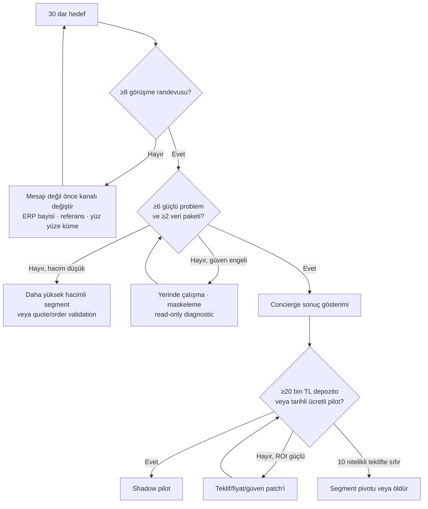

# Dağıtım ve Satış Kolu

> **Amaç:** İlgi toplamak değil; doğru hacimdeki şirkete ulaşıp gerçek dosya ve gerçek para taahhüdü almak.

[← Ana karar ağacı](index.md)

## 1. Satış tezinin özü

İlk satış mesajı “AI sipariş otomasyonu yaptım” değildir.

> “Son beş siparişinizin hangi kanaldan geldiğini, ERP'ye kaç dakikada girdiğini ve hangi satırların tekrar kontrol gerektirdiğini birlikte ölçelim. Üç gerçek siparişi aynı gün onaylı ERP importuna çevirip önce/sonra farkını göstereceğim. Sonuç çıkmazsa devam etmeyiz.”

Bu mesaj:

- gelecekteki niyeti değil geçmiş davranışı açar,
- demo yerine gerçek dosya ister,
- müşterinin sistemini değiştirmez,
- sonuç ölçümünü öne alır,
- AI vaadi yerine operasyon kaybını konuşur.

## 2. İlk 30 kişi

| Grup | Sayı | Kim? | Neden? |
|---|---:|---|---|
| Şirket sahibi / GM | 10 | Teknik distribütör sahipleri ve genel müdürleri | Bütçe, aciliyet ve merkezî karar |
| Satış / operasyon müdürü | 8 | İç satış, satış operasyonu, sipariş yöneticisi | Süreç, SLA ve yoğun dönem kaybı |
| Günlük kullanıcı | 8 | Sipariş girişi, satış destek, müşteri operasyonu | Gerçek workaround, dosya ve exception dili |
| ERP bayisi / entegratörü | 4 | Logo/Mikro çözüm ortakları | Teknik erişim, müşteri kanalı ve engel/ortak teşviki |

### Kaynak kanalları

1. Kurucunun mevcut HVAC ve teknik servis tedarikçileri.
2. Perpa, İkitelli, Dudullu ve Karaköy teknik ticaret kümeleri.
3. Logo ve Mikro çözüm ortakları.
4. LinkedIn'de “sipariş operasyon”, “iç satış”, “satış destek”, “ERP sorumlusu” rolü bulunan şirketler.
5. İlk görüşmelerden tedarikçi ve meslektaş referansları.
6. Sektör fuarı/dernek/bayi listesi — yalnız dar segment için.

## 3. Hedef şirket matrisi

Her aday için şu alanlar tutulur:

| Alan | Neden gerekli? |
|---|---|
| Şirket ve sektör | Tek dikey disiplinini korur |
| Çalışan sayısı | Çok küçük ve enterprise uçlarını ayırır |
| Tahmini SKU | Eşleştirme karmaşıklığı sinyali |
| ERP ve sürüm | Entegrasyon dalı |
| Sipariş kanalları | Portal dışı yapılandırılmamış veri payı |
| Günlük/aylık hacim | P1 kapısı |
| Karar verici | Satış döngüsü |
| Günlük kullanıcı | Gerçek süreç ve bypass |
| Satın alma tetikleyicisi | Acil bütçe |
| Son somut olay | Problem şiddeti |
| Mevcut çözüm | Rekabet ve bütçe |
| Veri paylaşım durumu | P2 kapısı |
| Teklif/taahhüt | D1 kapısı |
| Sonraki dal | Devam, güven patch'i, kanal değişimi, pivot veya öldür |

## 4. Görüşme soruları

Gelecek niyeti sorulmaz. “Böyle bir ürün kullanır mıydınız?” yasaktır.

### Son olay

- Dün gelen son beş sipariş hangi kanallardan geldi?
- Son siparişin ERP'ye girmesi kaç dakika sürdü?
- Geçen ay yanlış ürün, yanlış miktar, yanlış birim veya kaçırılan sipariş oldu mu?
- Son hatanın müşteriye ve ekibe etkisi neydi?
- Yoğun dönemde kuyruk ne kadar büyüyor?

### Mevcut çözüm

- Sipariş personeli yarın ayrılsa süreç nerede kırılır?
- Müşterinin kodunu kendi SKU'nuzla nasıl eşleştiriyorsunuz?
- Paket/koli/adet dönüşümlerini nerede tutuyorsunuz?
- Kullandığınız Excel, not defteri veya takma ad listesi var mı?
- Bayi portalınız varsa siparişlerin yüzde kaçı hâlâ e-posta/WhatsApp'tan geliyor ve neden?
- ERP veya entegratör bugün hangi kısmı çözüyor, hangi kısmı bırakıyor?

### Bütçe ve karar

- En son ne zaman bu iş için çalışan aldınız?
- Son 12 ayda yazılım, entegrasyon veya danışmana para ödediniz mi?
- Bu süreci iyileştirmek için bütçe kimin elinde?
- Yanlış sipariş veya gecikmenin maddi karşılığını nasıl takip ediyorsunuz?
- Üç gerçek siparişte süre ve hata farkını göstersek ücretli diagnostic kararını kim verir?

### Güven ve veri

- Anonimleştirilmiş son 20 sipariş e-postasını veya beş PDF/Excel'i paylaşabilir misiniz?
- SKU ana listenizi ve ERP import şablonunu paylaşma engeli nedir?
- Veri yalnız yerinde veya şirket ağında işlenirse karar değişir mi?
- Canlı sisteme yazmadan shadow mode kabul edilir mi?

## 5. İstenecek gerçek kanıt

Minimum paket:

- son 20 sipariş e-postası veya temizlenmiş export,
- beş PDF/Excel sipariş,
- SKU ana listesi,
- varsa müşteri kodu ↔ SKU tablosu,
- ERP import örneği,
- hatalı/gecikmiş bir sipariş ekranı,
- çalışanın kullandığı Excel veya not listesi,
- son 30 gün sipariş sayısı,
- bir siparişin baştan sona ekran paylaşımı.

Dosya gelmeden “problem doğrulandı” yazılmaz.

## 6. Taahhüt merdiveni

En güçlüden zayıfa:

1. **≥20.000 TL depozito**
2. İmzalı ve tarihli ücretli pilot siparişi
3. 100+ gerçek kayıt + SKU + ERP import erişimi
4. Şirket içinde süreç sahibinin atanması
5. İkinci görüşmeye patron + operasyon sorumlusunun katılması
6. Yazılı pilot tarihi
7. Referans/introduction
8. “Güzel fikir”, “demo at”, telefon numarası — **kanıt değil**

## 7. Teklif mimarisi

### A. Diagnostic — güven/ödeme kapısı

| Alan | Hipotez |
|---|---|
| Fiyat | 20.000–25.000 TL + KDV |
| Süre | 3–7 gün |
| Veri | 100 sipariş satırı, SKU listesi, import şablonu |
| Teslim | Süre/hata baseline, üç örnek dönüşüm, exception haritası, ROI tahmini, pilot kararı |
| Canlı writeback | Yok |
| Başarı | ≥%60 süre potansiyeli ve ücretli shadow pilot kararı |

### B. Shadow pilot

| Alan | Hipotez |
|---|---|
| Fiyat | 45.000 TL / 14 gün; %50 peşin |
| Kapsam | Tek inbox, 100–300+ satır, read-only/paralel işleme |
| Teslim | Günlük onaylı import, ölçüm, alias/exception kütüphanesi |
| Başarı | ≥70 hızlı onay, <%2 kritik hata, ≥%60 süre azalması |
| Devam | 20–35 bin TL/ay + hacim bandı hipotezi; ancak saha verisiyle değişir |

### C. Sonuç bazlı katman

İlk modelde yalnız sonuç payı kullanılmaz. Ölçüm ihtilafı ve nakit riski nedeniyle:

- minimum kurulum/pilot ücreti,
- gerekirse doğrulanmış tasarruf veya kapasite artışına bağlı bonus,
- net baseline ve hesap yöntemi

kullanılır.

## 8. Dağıtım karar ağacı

## 9. ERP bayisi kanalı

### Avantaj

- mevcut müşteri güveni,
- sürüm/lisans bilgisi,
- kurulum ve destek,
- ilk 30 şirkete erişim,
- müşterinin canlı verisine güvenli yaklaşım.

### Risk

- müşteri erişimini engelleme,
- özelliği kendi özel projesine çevirme,
- tek bayiye bağımlılık,
- destek sorumluluğu belirsizliği,
- marjın büyük bölümünü alma.

### Partner teklifi

- bayi ERP/kurulum/destek ücretini alır,
- ürün alias/exception motoru ve diagnostic metodunu sağlar,
- lead kaynağı ve müşteri sahipliği yazılıdır,
- en az iki bağımsız partnerle çalışılır,
- müşteri sonuç verisi ürün tarafında anonim benchmark olarak tutulabilir; sözleşme ve KVKK sınırları içinde.

## 10. İlk 10 ve ilk 100 müşteri

### İlk 10

- kurucu çevresi,
- yüz yüze teknik ticaret kümeleri,
- ERP bayi referansı,
- gerçek dosyayla 48 saatlik concierge gösterimi,
- tek dikey, tek teklif.

### İlk 100 — yalnız O1 geçerse

- aynı dikeyde white-label/revenue-share ERP partner ağı,
- sektör derneği, bayi ağı ve fuar listesi üzerinden dar outbound,
- ölçülmüş vaka çalışması: dakika, hata, gecikme, kapasite,
- ortak SKU/ölçü dili sayesinde kısalan onboarding,
- “AI” değil sonuç ve güven mesajı,
- çoklu ERP'ye geçiş yalnız tekrar kullanım ve destek ekonomisi kanıtlanınca.

## 11. Güç ve engelleme

| Rol | Satış mesajı | Uygulamayı nasıl kırar? | Patch |
|---|---|---|---|
| Sahip/GM | Kapasite, hata, kritik kişi bağımlılığı | Süreç sahibi atamaz, yalnız demo ister | Pilot şartı: süreç sahibi + veri + ücret |
| Operasyon müdürü | SLA ve kuyruk | Kapsamı büyütür | Tek inbox ve üç teslimat sözleşmesi |
| Çalışan | Tekrar işten kurtulma, uzman onayı | Telefon siparişini dışarıda bırakır | Bypass ölçümü, gözetim yasağı, ortak tasarım |
| ERP bayisi | Yeni gelir ve müşteri memnuniyeti | Erişimi/teknik bilgiyi kilitler | Yazılı gelir paylaşımı, iki partner |
| Finans/hukuk | Veri ve sözleşme güveni | Pilot gecikir | Önceden DPA, veri haritası, shadow mode |

## 12. Satış kapıları

- **D0 erişim:** 30 hedeften ≥8 görüşme.
- **P1 problem:** ≥6 nitelikli görüşmede güçlü ve tekrarlanan acı.
- **P2 veri:** 30 hedeften ≥3 veri paylaşımı; ilk hafta ≥2.
- **T1 açık:** ≥5 görüşmede mevcut çözümün bıraktığı aynı dar sorun.
- **D1 ödeme:** ≥1 depozito veya imzalı ücretli pilot.
- **Kanal tekrarı:** İkinci 30 hedefte görüşme oranı ve veri paylaşımı korunur.

Ödeme çıkmadan “satış kanalı doğrulandı” denmez.
