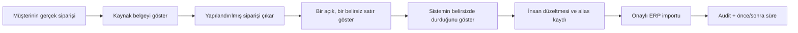

# Teknik Sunum ve Kapsam Paketi

> **Teknik karar:** Ürün, “AI OCR” veya “ERP otomasyonu” diye değil; **belirsiz siparişleri insana ayıran, onaylı ERP taslağı üreten sipariş operasyon masası** olarak sunulur.  
> **Ticari karar:** Teknik paket hazırdır fakat tam ürün geliştirme **P2 veri paylaşımı + D1 ücretli taahhüt** geçmeden açılmaz.  
> **Son güncelleme:** 2026-08-05

[← Ana karar ağacı](../index.md) · [Ürün kolu](../urun.md) · [Teknik mimari](mimari.md) · [Uygulama planı](uygulama-plani.md)

## 30 saniyelik sonuç

Müşteri “belgeyi hangi model okuyor?” diye ürün satın almaz. Şunu satın alır:

> **E-posta, PDF, Excel ve kontrollü WhatsApp çıktılarından gelen siparişleri; müşteri–SKU ilişkileri, paket kuralları ve insan onayıyla ERP'ye hazır hâle getiren güvenli operasyon katmanı.**

Ürünün yüzü bir chatbot veya genel dashboard değildir. Ana deneyim:

1. Gelen sipariş kuyruğu,
2. Kaynak belge ile yapılandırılmış siparişin yan yana görünümü,
3. Yalnız belirsiz satırların düştüğü exception kuyruğu,
4. İnsan onaylı CSV/API çıktısı,
5. Her alanın kaynağı, düzeltmesi ve onayını gösteren audit kaydıdır.

Bu sunum biçimi üç kritik korkuyu aynı anda azaltır:

- “AI yanlış ürün veya miktar girer.”
- “ERP'mi ve mevcut sürecimi değiştirmem gerekir.”
- “Çalışan kontrolü kaybeder ve sistem görünmez karar verir.”

### Güncel pazar sunumu araştırmasından sonuç

Güncel kategori oyuncuları ortak bir deseni doğruluyor:

- **Comena**, ürünü model teknolojisiyle değil “inbox'tan ERP'ye daha az veri girişi, daha fazla satış” sonucu üzerinden anlatıyor.
- **Distro**, dağıtıcıya özel arayüz, mevcut ERP'yi güçlendirme, çalışanı ikame etmeme ve ölçülebilir ROI vurgusu yapıyor; tam canlıya geçiş süresini ERP karmaşıklığı ve veri hazırlığına bağlayarak çoğu kurulum için 3–5 haftalık çerçeve veriyor.
- **ArisaiSoft**, Türkiye'de PDF/e-posta/Excel/WhatsApp → ERP, exception-only insan müdahalesi ve verinin yerinde kalması iddialarını zaten kullanıyor. Bu nedenle “çok kaynaktan ERP'ye AI aktarım” tek başına farklılaşma değildir.

Bizim sunum sentezimiz:

> **Geniş “AI satış işletim sistemi” vaadi değil; tek teknik dikeyde, gerçek sipariş dosyası üzerinde, kaynağı gösteren ve bilmediğinde duran sipariş kontrol masası.**

14 günlük teklif tam canlıya geçiş vaadi değildir. Yalnız shadow pilot ve ölçüm dönemidir; production onboarding, ERP sürümü/veri hazırlığına göre ayrıca planlanır.

## 1. Ürün kategorisi ve anlatım dili

### Kullanılacak kategori adı

**İnsan onaylı sipariş operasyon katmanı**  
Müşteri dilinde daha kısa kullanım: **Sipariş Kontrol Masası** veya **ERP Öncesi Sipariş Masası**.

Bunlar nihai marka adı değildir. Satışta ürünün ne yaptığını açıklayan kategori etiketidir; isim/logo işi ücretli pilot sonrasına kadar dondurulur.

### Tek cümlelik değer önerisi

> Gelen siparişi müşterinin kullandığı kanaldan alır, ürün ve paket kurallarıyla kontrol eder, yalnız belirsiz satırları çalışana gösterir ve onaylanan siparişi Logo/Mikro'ya hazırlar.

### Söylenmeyecek ifadeler

| Söylenmeyecek | Neden | Yerine söylenecek |
|---|---|---|
| “%100 otomatik sipariş” | Güven kaybı ve kanıtsız vaat | “Belirsiz işlemi otomatik geçirmeyen, insan onaylı akış” |
| “AI OCR platformu” | Özellik anlatır; ekonomik sonucu anlatmaz | “Sipariş başına insan süresini ve kritik hatayı azaltır” |
| “ERP'nizi değiştiriyoruz” | Entegrasyon ve geçiş korkusu yaratır | “Mevcut ERP'nin önünde çalışır” |
| “Her belgeyi okur” | İlk pilot kapsamını kontrolsüz büyütür | “Seçilen dikey, belge ve sipariş tipinde ölçülür” |
| “Model zamanla kendi öğrenir” | Kontrolsüz öğrenme izlenimi verir | “Onaylı düzeltmeler alias/kural hafızasına eklenir” |
| “Çalışanı ortadan kaldırır” | Bypass ve direnç yaratır | “Çalışanı veri girişinden istisna uzmanlığına taşır” |

## 2. Ürün yüzü: gösterilecek altı ekran

### 2.1 Gelen Siparişler

Tek inbox veya yükleme kanalındaki siparişleri şu durumlarla gösterir:

- Yeni
- İşleniyor
- İnceleme gerekli
- Onaya hazır
- Onaylandı
- ERP'ye aktarıldı
- Hata / yeniden deneme

Her kartta müşteri, kanal, belge tipi, satır sayısı, kritik exception sayısı ve SLA yaşı görünür. Model adı veya token sayısı müşteri ekranının ana öğesi değildir.

### 2.2 Sipariş İnceleme — ana ekran

En kritik ürün ekranı bölünmüş görünüm olmalıdır:

- **Sol:** Kaynak e-posta/PDF/Excel ve seçili satırın vurgusu.
- **Orta:** Müşteri, ürün, miktar, birim, fiyat ve teslimat alanları.
- **Sağ:** Eşleşme nedeni, confidence sınıfı, alternatif SKU'lar ve iş kuralı.

Kullanıcı bir alanı değiştirdiğinde:

- eski değer,
- yeni değer,
- değişiklik nedeni,
- onaylayan,
- alias/kural hafızasına eklenip eklenmediği

kaydedilir.

### 2.3 Exception Kuyruğu

Ürünün güven vaadini taşıyan ekran budur. Yalnız şu durumlar düşer:

- müşteri hesabı belirsiz,
- ürün/SKU adayları birbirine yakın,
- koli–adet–paket dönüşümü güvenli değil,
- miktar veya fiyat birden fazla yerde çelişiyor,
- ERP ana verisiyle belge uyuşmuyor,
- zorunlu alan eksik,
- duplicate sipariş şüphesi var.

Amaç exception oranını sıfıra indirmek değildir. Amaç **yanlış işlemi otomatik geçirmeden hızlı çözmek**tir.

### 2.4 Eşleştirme Hafızası

Müşteri–SKU alias'ları, ürün kısaltmaları, paket dönüşümleri ve belge şablonları burada yönetilir.

- Otomatik öneri ayrı,
- insan onayı ayrı,
- yalnız bir müşteriye ait ilişki ayrı,
- sektör ortak sözlüğüne aday ilişki ayrı

tutulur. Bir müşterinin verisi başka müşterinin açık içeriği olarak gösterilmez.

### 2.5 ERP Çıktısı ve Writeback

İlk aşamada:

- onaylı CSV/import dosyası,
- alan eşleştirme önizlemesi,
- export idempotency anahtarı,
- başarı/hata raporu

sunulur.

Ü1 ve D1 geçtikten sonra test veritabanı veya resmî API/entegratör yoluyla insan onaylı writeback açılır.

### 2.6 Operasyon ve ROI Paneli

Dashboard yalnız karar üreten metrikleri gösterir:

- sipariş/satır hacmi,
- mevcut ve yeni aktif insan dakikası,
- hızlı onay oranı,
- exception oranı ve nedenleri,
- kritik false-pass oranı,
- tekrar kullanılan alias oranı,
- müşteriye geri soru sayısı,
- bypass sayısı,
- tahmini değil, müşteriyle doğrulanmış ekonomik etki.

## 3. Beş dakikalık demo akışı

### Demo kuralı

Demo kusursuzluk tiyatrosu olmamalıdır. Bilerek bir belirsiz satır seçilir ve sistemin:

- otomatik geçmediği,
- kaynağı gösterdiği,
- adayları sıraladığı,
- insan kararını kaydettiği

gösterilir. Güveni “her şeyi bildiğini” göstererek değil, **bilmediğinde durduğunu** göstererek kurar.

### Beş dakikalık anlatım

1. **Problem:** “Bu sipariş bugün kaç ekrana ve kaç dakikaya dağılıyor?”
2. **Girdi:** Müşterinin gerçek PDF/Excel/e-postası.
3. **Kontrol:** Kaynak satırla yapılandırılmış alan yan yana.
4. **İstisna:** Yanlış olabilecek satır otomatik geçmiyor.
5. **Onay:** Çalışan tek ekranda düzeltip onaylıyor.
6. **Çıktı:** Logo/Mikro import formatı.
7. **Ekonomi:** Önce/sonra aktif dakika ve kritik risk.

### Gösterilmeyecek teknik ayrıntılar

İlk satış demosunda:

- prompt metni,
- model sağlayıcısı karşılaştırması,
- embedding grafiği,
- sistem logları,
- mikroservis diyagramı

ana anlatım değildir. Teknik alıcı isterse [mimari sayfası](mimari.md) açılır.

## 4. Ticari ve teknik paketler

### Paket A — 48 Saatlik Sipariş Diagnostic'i

| Alan | Kapsam |
|---|---|
| Amaç | Problem, veri ve ödeme kapısını düşük riskle doğrulamak |
| Girdi | 3–5 gerçek sipariş; tercihen ≥100 satırlık ek örnek; SKU listesi; import şablonu |
| Çıktı | Kaynaklı yapılandırılmış sipariş, exception listesi, ERP import taslağı, süre/ROI tablosu |
| Sistem davranışı | Manuel + kontrollü Python/LLM; canlı entegrasyon yok |
| Veri saklama | Yazılı sınıra göre minimum; diagnostic sonunda silme/teslim seçeneği |
| Fiyat hipotezi | 20–25 bin TL |
| Teknik başarı | Kritik alanlarda kaynak görünür; örnekte ≥%60 süre sinyali; veri kalite raporu |
| Sonraki kapı | Depozito/ücretli shadow pilot |

Diagnostic, ücretsiz demo değildir. Müşterinin kendi veri setinde ölçülen karar dosyasıdır.

### Paket B — 7–14 Günlük Shadow Pilot

| Alan | Kapsam |
|---|---|
| Amaç | Ü1, E1 ve çalışma teşviklerini gerçek akışta ölçmek |
| Kanal | Tek inbox veya kontrollü yükleme |
| Hacim | En az 100 gerçek satır; tercihen 100–300 |
| Ürün yüzü | Gelen sipariş, split review, exception kuyruğu, export, ölçüm |
| ERP davranışı | Onaylı CSV/import; canlı writeback yok |
| Fiyat hipotezi | 45 bin TL; en az %50 peşin |
| Başarı | ≥%70 hızlı onay, <%2 kritik hata, ≥%60 insan süresi azalması, ikinci ödeme niyeti |
| Sonraki kapı | Kontrollü writeback + ikinci müşteri |

### Paket C — Kontrollü Üretim

!!! warning "14 gün production sözü değildir"
    Shadow pilot 7–14 gündür. Tam canlı bağlantı; ERP ürünü/sürümü, master data kalitesi, yetkiler ve müşteri IT takvimine bağlı ayrı bir onboarding işidir. Kategori oyuncularının güncel kurulum anlatıları da tam canlıya geçişi veri hazırlığı ve ERP karmaşıklığına bağlı çok haftalı bir süreç olarak sunuyor.

Yalnız şu kapılar geçerse açılır:

- müşteri ikinci ödeme verir,
- Ü1 eşikleri geçer,
- fayda/maliyet ≥3 olur,
- gerçek ERP sürümü ve güvenli import/API yolu doğrulanır.

Kapsam:

- yönetilen e-posta/kanal bağlantısı,
- sürekli exception operasyonu,
- müşteri–SKU hafızası,
- insan onaylı writeback,
- rollback/audit,
- rol bazlı erişim,
- aylık performans raporu.

Fiyat hipotezi mevcut kararda **20–35 bin TL/ay + kurulum/işlem hacmi**dir; saha kanıtı çıkmadan kesin fiyat listesine dönüşmez.

### Paket D — Dedicated/VPC/On-Prem

Varsayılan ürün değildir. Yalnız müşteri güvenlik politikası veya veri yerleşimi gerektirirse, ayrı kurulum ve destek bedeliyle açılır.

- müşteri VPC'si veya yerel altyapı,
- müşteri anahtar yönetimi,
- sınırlı dış bağlantı,
- ayrı model sağlayıcı seçimi,
- ek bakım ve sürüm sorumluluğu.

Bu paket erken müşteride ücretsiz güven patch'i olarak verilmez; ürün ekonomisini özel projeye çevirebilir.

## 5. Kapsam matrisi

| Yetenek | Diagnostic | Shadow Pilot | Kontrollü Üretim | Dondurulan |
|---|---:|---:|---:|---:|
| Manuel yükleme | ✓ | ✓ | ✓ |  |
| E-posta yönlendirme / tek inbox | Opsiyonel | ✓ | ✓ |  |
| PDF ve dijital belge çıkarımı | ✓ | ✓ | ✓ |  |
| Excel/CSV native parse | ✓ | ✓ | ✓ |  |
| Taranmış belge OCR/vision fallback | Gerektikçe | ✓ | ✓ |  |
| Müşteri–SKU alias eşleştirme | Basit | ✓ | ✓ |  |
| Paket/birim iş kuralları | Basit | ✓ | ✓ |  |
| Exception kuyruğu | Liste | ✓ | ✓ |  |
| İnsan onayı | ✓ | ✓ | ✓ |  |
| CSV/import export | ✓ | ✓ | ✓ |  |
| Canlı ERP writeback |  |  | Kapı sonrası | ✓ pre-proof |
| Canlı WhatsApp Business API |  |  | Ayrı kanıt sonrası | ✓ pre-proof |
| Otomatik fiyat/iskonto |  |  |  | ✓ |
| Müşteriye otomatik cevap |  |  | Ayrı güven/ton testi | ✓ pre-proof |
| Stok optimizasyonu |  |  |  | ✓ |
| Genel belge platformu |  |  |  | ✓ |

## 6. Roller ve yetkiler

| Rol | Ana işi | Yapabileceği | Yapamayacağı |
|---|---|---|---|
| Sipariş uzmanı | Satırı incelemek ve onaylamak | Düzeltme, neden kodu, alias önerisi, export | Yetkisiz fiyat kuralı veya tenant ayarı |
| Operasyon yöneticisi | Kuyruk, SLA ve sonuç takibi | Atama, ikinci onay, performans/ROI görünümü | Ham müşteri verisini başka tenant'a açmak |
| ERP yöneticisi/partner | Alan eşleştirme ve writeback | Test bağlantısı, import şablonu, rollback | Sipariş içeriğini satış amacıyla kullanmak |
| Tenant yöneticisi | Kullanıcı, saklama ve güvenlik politikası | Rol, kanal, veri silme, audit export | Sistem genelindeki diğer müşterileri görmek |
| Sistem operatörü | Teknik sağlık ve destek | Maskeli log, job retry, olay yönetimi | Varsayılan olarak belge içeriğini okumak |

## 7. Müşteriye verilecek güven paketi

Satış sunumunun teknik eki şunları içermelidir:

1. Tek sayfalık veri akışı,
2. Shadow mode sınırları,
3. İşlenen veri alanları,
4. Saklama ve silme politikası,
5. Model sağlayıcı/veri aktarım tablosu,
6. Rol ve yetki matrisi,
7. Audit log örneği,
8. Hata/rollback prosedürü,
9. Pilot başarı ve öldürme eşikleri,
10. DPA/veri işleyen sözleşmesi için bilgi formu.

Bu paket hukuk görüşü yerine geçmez; müşterinin KVKK ve sözleşme bağlamı uzmanla doğrulanır.

## 8. Sunum karar kapıları

| Gözlem | Hüküm | Açılan dal |
|---|---|---|
| Müşteri “AI” ile ilgileniyor ama dosya/para vermiyor | İlgi, talep değildir | Diagnostic teklifini tekrar et; ürün yapma |
| Kaynak görünümü ve abstention güven yaratıyor | Ürün yüzü doğru | Shadow pilot |
| Müşteri yalnız dashboard istiyor | Problem yanlış veya alıcı günlük kullanıcı değil | Operasyon walkthrough'una dön |
| Asıl acı fiyat/stok kontrolü | Order entry yalnız giriş kapısı | Quote/order validation / marj dalı |
| CSV yeterli ve hızlı değer veriyor | API acele değil | CSV-first üretim |
| ERP partneri güveni ve erişimi hızlandırıyor | Partner kanalına geç | Revenue-share/entegrasyon paketi |
| Dedicated kurulum satışın şartı fakat fiyat kabul edilmiyor | Ekonomi kırılıyor | Segmenti/teklifi değiştir veya öldür |

## 9. Teknik araştırmadan çıkan ana tasarım kararları

- Çeşitli belge biçimlerinde yalnız metin veya yalnız şablon yaklaşımı yetersiz kalabilir; pipeline, native parse + layout/OCR + iş kuralı + gerektiğinde model birleşimi olmalıdır.
- Eksik veya düşük güvenli alanlar insan incelemesine yönlendirilmelidir; insan incelemesi “geçici hata” değil ürünün güven katmanıdır.
- Model çıktısı serbest metin değil, doğrulanan katı sipariş şemasına dönmelidir.
- Belge içeriği güvenilmeyen veri kabul edilmelidir; içindeki talimatlar sistem veya araç komutu olarak yürütülmemelidir.
- Ürün; trace, metric ve audit event'lerini birbirinden ayırarak hem teknik hata hem iş sonucu görünürlüğü sağlamalıdır.

Bu kararların ayrıntısı [Teknik Mimari](mimari.md) sayfasındadır.

## Kaynak ve dayanaklar

### Repo içi pazar/ürün dayanakları

- [Ürün ve Çözüm Kolu](../urun.md)
- [Deneyler ve Ölçüm Planı](../deneyler.md)
- [Küresel Sinyal ve Türkiye Kanıt Radarı](../kanit-radari.md)
- [Karar Günlüğü](../karar-gunlugu.md)

### Teknik birincil kaynaklar

- [OpenAI API — Structured Outputs / JSON Schema](https://platform.openai.com/docs/guides/structured-outputs)
- [OpenAI API — Data controls, retention ve residency](https://platform.openai.com/docs/models/default-usage-policies-by-endpoint)
- [AWS sample — layout-aware document pipeline ve düşük güvenli alanlarda human review](https://github.com/aws-samples/amazon-textract-transformer-pipeline)
- [Microsoft Document Intelligence — confidence, grounding ve human review](https://learn.microsoft.com/en-us/azure/ai-services/document-intelligence/concept/accuracy-confidence?view=doc-intel-4.0.0)
- [OWASP GenAI Security — LLM application risks](https://github.com/OWASP/www-project-top-10-for-large-language-model-applications)
- [OpenTelemetry — telemetry specification and semantic conventions](https://github.com/open-telemetry/opentelemetry-specification)
- [Comena — inbox-to-ERP positioning](https://comena.ai/en/)
- [Distro — distributor workflow, ERP and implementation positioning](https://distro.app/)
- [Distro — implementation and onboarding](https://distro.app/implementation)
- [ArisaiSoft — Türkiye çok kaynaklı AI belge işleme ve ERP entegrasyonu](https://arisaisoft.com/)
- [Mikro resmî API dokümantasyonu](https://apidocs.mikro.com.tr/)
- [Logo özelleştirme ve entegrasyon](https://www.logo.com.tr/dijital-donusum-hizmetleri/ozellestirme-ve-entegrasyon)
- [KVKK — Yurt dışına aktarım](https://www.kvkk.gov.tr/Icerik/2053/Yurtdisina-Aktarim)

!!! note "Kaynak ile tasarım kararını ayır"
    Kaynaklar teknik imkân ve risk desenlerini destekler. Bu sayfadaki stack, paket ve ekran kararları ise bu startup'ın kurucu kapasitesi, pilot süresi ve risk kapılarına göre yapılmış tasarım sentezidir; sağlayıcı zorunluluğu değildir.
