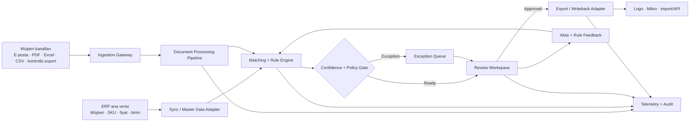
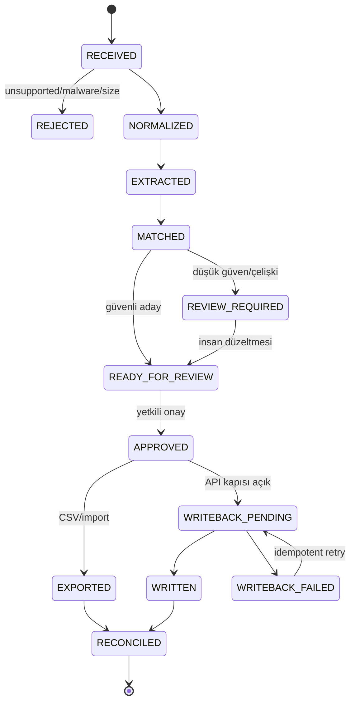

# Teknik Mimari

> **Mimari hedef:** Bir sipariş belgesini “LLM cevabı”na değil; kaynakları görünür, doğrulanmış, onaylanabilir ve idempotent bir **sipariş iş akışı**na dönüştürmek.  
> **Mimari şekil:** İlk iki müşteri için modüler monolit + worker; mikroservis, özel model ve tam on-prem ürünleşme dondurulur.

[← Teknik paket](index.md) · [Uygulama planı](uygulama-plani.md) · [Ürün kolu](../urun.md)

## 1. Tasarım ilkeleri

1. **ERP ve ana veri kaynak, model yardımcıdır.** Ürün, fiyat, müşteri ve paket doğrulamasında ERP/master data model çıktısından üstündür.
2. **Native parse önce, model sonra.** Excel/CSV hücreleri veya dijital PDF metni varken görüntü/LLM ile yeniden tahmin edilmez.
3. **Katı şema, serbest metinden önce gelir.** Her extraction, Pydantic/JSON Schema ile doğrulanır.
4. **Confidence tek başına karar değildir.** Model güveni; iş kuralı, ana veri uyumu, tarihsel eşleşme ve alan kritikliğinden oluşan karar skorunun yalnız bir girdisidir.
5. **Abstention bir özellik.** Güvenli olmayan satır otomatik geçmez.
6. **İnsan onayı writeback sınırıdır.** Shadow ve ilk üretim aşamasında kritik alanlar onaysız ERP'ye yazılmaz.
7. **Her işlem tekrar çalıştırılabilir ve idempotent olmalıdır.** Aynı e-posta veya export iki sipariş yaratmamalıdır.
8. **Müşteri izolasyonu varsayılandır.** Tenant kimliği veri modelinin sonradan eklenen alanı değil, bütün nesnelerin zorunlu anahtarıdır.
9. **Ölçüm ürünün parçasıdır.** Süre, exception, false-pass, alias reuse ve writeback sonucu tutulmadan ürün doğrulanmış sayılmaz.
10. **Mikroservis değil değiştirilebilir sınırlar.** Model, OCR ve ERP adaptörleri arayüzle ayrılır; ilk sürüm tek deploy edilebilir uygulamadır.

## 2. Sistem bağlamı



## 3. İşlem durum makinesi



Durum değişiklikleri event olarak saklanır. Kullanıcı arayüzü doğrudan rastgele alan güncellemez; bir command oluşturur ve audit event'i üretir.

## 4. Bileşenler

### 4.1 Ingestion Gateway

İlk aşamada destek sırası:

1. Manuel yükleme,
2. Güvenli e-posta yönlendirme veya tek inbox,
3. SFTP/klasör entegrasyonu gerekiyorsa,
4. Resmî WhatsApp Business entegrasyonu yalnız kanal kanıtı sonrası.

Görevleri:

- MIME/type doğrulama,
- dosya boyutu ve sayfa sınırı,
- malware taraması,
- e-posta message-id ve içerik hash'iyle duplicate kontrolü,
- tenant ve kanal etiketleme,
- ham dosyayı immutable object storage'a yazma,
- işleme job'ı oluşturma.

### 4.2 Normalization ve Native Parsers

Belge tipine göre:

- XLSX/CSV: hücre ve tablo yapısını doğrudan okur.
- Dijital PDF: text layer ve koordinatları alır.
- Taranmış PDF/görüntü: OCR/layout motoruna gider.
- E-posta: body, attachment ve header ayrı varlıklardır.

Amaç bütün girdileri ortak `NormalizedDocument` yapısına çevirmektir:

- sayfa/blok/satır,
- metin,
- bounding box veya hücre koordinatı,
- kaynak dosya ve sayfa,
- parser confidence,
- tablo ilişkileri.

### 4.3 Extraction Adapter

Extraction sağlayıcısı değiştirilebilir arayüzdür. İlk uygulama:

1. deterministic parser sonuçları,
2. layout/OCR sonucu,
3. gereken alanlarda vision/LLM,
4. katı `CanonicalOrder` şeması

üretir.

Model doğrudan ERP aracı çağıramaz. Yalnız doğrulanacak yapı üretir.

Örnek şema:

```json
{
  "document_id": "doc_...",
  "external_order_reference": "PO-1842",
  "customer": {
    "raw_name": "ABC Teknik",
    "raw_code": "M-0091"
  },
  "lines": [
    {
      "source_ref": {"page": 1, "line": 7},
      "raw_product_code": "VLV-20K",
      "raw_description": "20lik vana kırmızı",
      "quantity": 20,
      "unit": "koli",
      "unit_price": null
    }
  ],
  "delivery_note": null
}
```

Şema doğrulamasından geçmeyen çıktı işleme hatasıdır; kısmen doğruymuş gibi sonraki aşamaya geçmez.

### 4.4 Master Data Sync

ERP'den veya müşterinin export'undan minimum veri:

- customer account,
- SKU/product master,
- birim ve paket dönüşümleri,
- aktif/pasif ürün,
- gerekirse müşteri özel fiyat/iskonto okuma görünümü,
- ERP import alanları.

İlk pilotta full bi-directional sync gerekmez. Salt-okunur snapshot yeterlidir. Snapshot sürümlenir; hangi siparişin hangi master data sürümüyle eşleştiği kaydedilir.

### 4.5 Matching ve Rule Engine

Aday üretim sırası:

1. Tam müşteri kodu / tam SKU,
2. Onaylı müşteri–SKU alias'ı,
3. Normalize edilmiş kod,
4. Geçmiş sipariş eşleşmesi,
5. Ürün ailesi + ölçü + varyant kuralları,
6. PostgreSQL trigram/fuzzy search,
7. Gerekirse semantic candidate retrieval,
8. Son sıralama ve iş kuralı kontrolü.

`pgvector` veya ayrı vector database başlangıç şartı değildir. Önce exact/alias/trigram baseline ölçülür. Semantic retrieval yalnız recall açığı gerçekten gösterilirse açılır.

### 4.6 Confidence ve Policy Gate

Tek bir model confidence yüzdesi kullanılmaz. Alan kararı örneğin şu bileşenlerden oluşur:

- extraction kaynağı ve confidence,
- exact/alias/history eşleşme tipi,
- adaylar arası skor farkı,
- master data aktifliği,
- birim/paket kural uyumu,
- müşteri geçmişi,
- alan kritiklik sınıfı,
- duplicate/çelişki sinyali.

Çıktı üç sınıftır:

- **Green:** hızlı insan onayına hazır,
- **Amber:** bir veya daha fazla alan inceleme ister,
- **Red:** zorunlu veri yok, kritik çelişki veya güvenlik sorunu.

Green, “onaysız writeback” anlamına gelmez; ilk ürün aşamasında yalnız review sırasını hızlandırır.

### 4.7 Review Workspace

Review API'si şu davranışları destekler:

- kaynak referansına git,
- alanı düzelt,
- aday SKU seç,
- exception reason code seç,
- alias önerisini kabul/reddet,
- toplu hızlı onay,
- ikinci onay gerektiren kritik alan,
- export önizlemesi,
- immutable audit event.

### 4.8 Export ve ERP Adapter

#### Mikro için güncel teknik gerçeklik

Mikro'nun güncel resmî dokümantasyonu REST/JSON API, V16/V17 Postman koleksiyonları, mock server, test DB ve kayıt endpoint'leri sunuyor. Fakat servis müşteri ortamında çalışan yerel bir Windows servisi olarak tarif ediliyor; sürüme göre port ve alan farkı var ve Active-Active desteklenmediği belirtiliyor. Bunun mimari sonucu:

- cloud uygulamasından müşteri API portunu internete açmak varsayılan çözüm değildir,
- küçük bir **outbound site connector** veya müşteri VPN/özel ağ bağlantısı tercih edilir,
- connector yalnız allowlist endpoint ve tenant credential'ıyla çalışır,
- API version ve ERP mapping ayrı konfigürasyondur,
- test DB/mock üzerinde doğrulanmadan canlı writeback açılmaz,
- connector heartbeat, queue ve idempotency receipt üretir.

Logo güncel resmî sayfası üçüncü taraf yazılımların entegrasyonunu doğruluyor; ancak tek ve herkese açık standart endpoint varsayımı yapılmaz. Logo yolu müşteri ürünü/sürümü ve yetkili iş ortağıyla keşfedilir.

Adapter sözleşmesi:

```text
validate(payload, master_data_version)
preview(payload)
export_csv(payload, mapping_version)
writeback(payload, idempotency_key)
reconcile(external_receipt)
rollback(external_receipt)  # ERP destekliyorsa
```

Güvenlik sırası:

1. CSV önizleme,
2. CSV/import,
3. test şirketi/veritabanı API,
4. insan onaylı canlı API,
5. kanıtlanırsa sınırlı straight-through processing.

Her writeback:

- tenant,
- order/version,
- onaylayan,
- idempotency key,
- mapping version,
- ERP response/receipt,
- retry sayısı

ile loglanır.

### 4.9 Feedback ve Alias Hafızası

Düzeltme iki farklı nesne üretir:

- **Review correction:** O siparişe ait kesin tarihsel olay.
- **Alias/rule proposal:** Geleceğe uygulanabilecek, ayrıca onaylanan kural.

Her düzeltme otomatik global kurala dönüşmez. Scope:

- tenant-only,
- customer-only,
- product-family,
- sector candidate

olarak ayrılır. Sektör ortak kuralına yükseltme veri sızıntısı yaratmayacak biçimde yapılır.

## 5. Önerilen teknoloji yığını

| Katman | İlk tercih | Neden | Ne zaman değişir? |
|---|---|---|---|
| Frontend | React + TypeScript | Split review ve yoğun tablo etkileşimi | Mobil-first gerekirse ayrı değerlendirme |
| Backend API | Python + FastAPI + Pydantic | Kurucu becerisi; katı şema; hızlı entegrasyon | Büyük ekip/servis sınırı çıkarsa |
| System of record | PostgreSQL | Transaction, JSONB, RLS, trigram, güçlü audit modeli | İlk yıllarda değişmez |
| Fuzzy matching | PostgreSQL `pg_trgm` | Ek altyapı olmadan baseline | Recall yetersizse embeddings |
| Vector | Başlangıçta yok; gerekirse `pgvector` | Premature vector stack'i önler | Ölçülen alias recall açığında |
| Job queue | Redis + Dramatiq worker | Async belge işi, retry, basit operasyon | Uzun human-wait workflow büyürse Temporal benzeri durable engine |
| Object storage | S3-compatible bucket | Ham belge ve normalize çıktı ayrımı | Dedicated müşteri storage ihtiyacı |
| OCR/model | Adapter katmanı | Sağlayıcı değiştirme ve veri yerleşimi | Maliyet/kalite/regülasyon sinyaline göre |
| Auth | OIDC-ready RBAC | Custom auth riskini azaltır | Dedicated kurulumda müşteri IdP/Keycloak |
| Telemetry | OpenTelemetry + hata izleme | Trace/metric/log korelasyonu | Sağlayıcı değişebilir; semantik aynı kalır |
| Deploy | Docker; managed container + managed Postgres | 1–2 kişilik ekip için düşük operasyon | Dedicated/VPC paketinde IaC |
| CI | Unit + schema + regression + migration + secret scan | Belge/model regresyonunu yakalar | Writeback açıldığında integration/e2e genişler |

### Neden modüler monolit?

İlk iki müşteride:

- tek transaction modeli,
- daha az deployment yüzeyi,
- daha kolay debug,
- daha düşük gözlem ve güvenlik maliyeti,
- hızlı schema değişimi

gereklidir.

Kod modülleri ayrılır fakat ayrı servis deploy edilmez:

```text
app/
  api/
  auth/
  tenants/
  ingestion/
  documents/
  extraction/
  matching/
  rules/
  review/
  integrations/
    logo/
    mikro/
  evaluation/
  telemetry/
  audit/
workers/
web/
```

Mikroservise geçiş ancak bağımsız ölçek, güvenlik sınırı veya ekip sahipliği oluşursa yapılır.

## 6. Ana veri modeli

| Varlık | Kritik alanlar | Not |
|---|---|---|
| Tenant | id, policy, retention, region | Bütün nesnelerin zorunlu üst anahtarı |
| User/Role | tenant, permissions, MFA/IdP | En az yetki |
| Channel | type, external id, credential ref | Credential içerik DB'de düz tutulmaz |
| Document | hash, MIME, storage ref, status | Immutable ham dosya |
| DocumentBlock | page/cell/bbox/text/source | Kaynak görünürlüğü |
| OrderDraft | customer candidate, version, state | Her değişiklik versiyonlu |
| OrderLine | raw fields, canonical fields, source refs | Kritik alanlar ayrı |
| MatchCandidate | entity, score, features, rank | Açıklanabilir aday listesi |
| Exception | type, severity, owner, resolution | Kuyruk ve maliyet ölçümü |
| ReviewEvent | before/after/reason/actor | Append-only |
| AliasRule | scope, pattern, target, approval | Otomatik öğrenme değil kontrollü hafıza |
| ERPMapping | ERP/version/document type/field map | Sürüm bağımlılığı |
| Export/Writeback | idempotency key, receipt, status | Duplicate önleme |
| EvaluationCase | golden truth, model/parser version | Regression seti |
| MetricEvent | latency, human time, outcome | İş sonucu telemetry'si |

## Devam eden teknik katmanlar

Güvenlik, veri kontrolü, evaluation, telemetry, hata davranışı ve teknik karar kapıları [Güvenlik, Kalite ve Operasyon](guvenlik-kalite.md) sayfasında devam eder.
