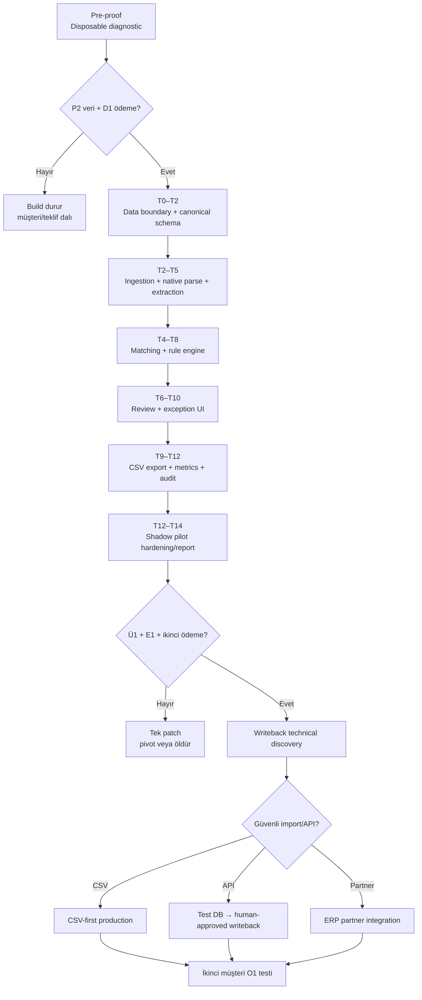

# Teknik Uygulama Planı

> **Plan türü:** Takvimden çok karar kapılarına bağlı build planı.  
> **Başlangıç koşulu:** P2 gerçek veri + D1 ücretli taahhüt.  
> **T0:** Depozitonun ve yazılı pilot kapsamının alındığı gün.

[← Teknik paket](index.md) · [Teknik mimari](mimari.md) · [Deneyler](../deneyler.md) · [Karar günlüğü](../karar-gunlugu.md)

## 1. Build ilkesi

Teknik planın amacı aylarca platform yapmak değil, 7–14 günlük ücretli shadow pilotta şu kararları üretmektir:

1. Native parse + extraction gerçek belgede yeterli mi?
2. Customer/SKU/unit matching review süresini azaltıyor mu?
3. Exception-first ürün yüzü çalışan tarafından kullanılabiliyor mu?
4. CSV/import müşteriye gerçek değer veriyor mu?
5. Hangi parçalar ikinci müşteride tekrar kullanılabilir?

P2/D1 öncesi yalnız diagnostic için disposable veya düşük bakım maliyetli araç yazılır. Pilot sonrasında kullanılıp kullanılmayacağı belli olmayan production altyapısı yapılmaz.

## 2. Kapılı teknik yol haritası

## 3. Pre-proof teknik çalışma — T0'dan önce

### Yapılabilir

- Müşteriden gelen üç örneği lokal/güvenli ortamda parse eden script,
- canonical order Pydantic şeması,
- kaynak satır referansı,
- basit customer/SKU lookup,
- CSV import taslağı,
- süre ölçüm tablosu,
- güvenli silme checklist'i.

### Yapılmayacak

- kullanıcı yönetimi,
- multi-tenant panel,
- canlı mailbox connector,
- production database,
- writeback,
- otomatik alias öğrenmesi,
- geniş UI,
- model fine-tuning,
- genel belge platformu.

### Pre-proof Definition of Done

- Üç sipariş aynı canonical şemaya çevrildi.
- Her kritik alanın kaynak referansı var.
- En az bir belirsiz alan otomatik geçmedi.
- CSV/import taslağı müşteriyle gözden geçirildi.
- Önce/sonra aktif dakika ölçüldü.
- Yazılı teklif ve ödeme kararı üretildi.

## 4. T0–T14 shadow pilot planı

### Faz 0 — Pilot sözleşmesi ve veri sınırı | T0

Model sağlayıcısı kullanılacaksa retention/state davranışı da bu fazda seçilir. “API verisi eğitimde kullanılmıyor” tek başına yeterli değildir; endpoint bazında saklama, `store` ayarı, ZDR/MAM veya data residency uygunluğu ve yurt dışı aktarım yolu kaydedilir.

| Alan | İş |
|---|---|
| Test edilen varsayım | R1: veri ve güven sınırı yönetilebilir |
| Somut çıktı | Veri akış tablosu, işlenen alanlar, saklama/silme, yetkililer, tek inbox, başarı eşikleri |
| Teknik kabul | Tenant oluşturuldu; erişim listesi; veri retention; dış sağlayıcı envanteri; incident kişileri |
| Sahip | Faruk + müşteri süreç sahibi + müşteri IT/KVKK sorumlusu |
| Başarısızlık | Veri amacı, aktarım veya onay açıklanamıyor → yerinde/anonim diagnostic veya dur |

### Faz 1 — Temel iskelet | T0–T2

Teslimatlar:

- repo ve environment ayrımı,
- Docker tabanlı local/staging,
- PostgreSQL şeması ve migration,
- tenant/user/role iskeleti,
- object storage,
- document/order/audit temel varlıkları,
- canonical Pydantic şeması,
- job state ve idempotency modeli,
- secret yönetimi,
- telemetry temel kuralları.

Kabul:

- aynı dosya iki kez yüklenince iki order yaratmıyor,
- tenant A kullanıcısı tenant B verisini göremiyor,
- ham dosya DB yerine object storage'da,
- migration sıfırdan çalışıyor,
- test verisi production credential kullanmıyor.

### Faz 2 — Ingestion ve extraction | T2–T5

Teslimatlar:

- manuel upload,
- e-posta/attachment normalize kontratı,
- XLSX/CSV native parser,
- dijital PDF parser,
- scanned fallback adapter,
- strict structured extraction,
- kaynak page/cell/line referansı,
- processing status ve retry.

Kabul:

- desteklenen belge türlerinde canonical schema üretiliyor,
- geçersiz şema hazır order gibi görünmüyor,
- parser/model/version kaydediliyor,
- kaynak referansı review ekranına taşınabiliyor,
- timeout/retry exception'a güvenli düşüyor.

### Faz 3 — Master data ve matching | T4–T8

Teslimatlar:

- müşteri/SKU master import,
- exact + normalized code lookup,
- tenant/customer alias tablosu,
- `pg_trgm` candidate search,
- unit/package rule engine,
- candidate rank explanation,
- confidence/policy sınıfları,
- duplicate sipariş sinyali.

Kabul:

- her eşleşmenin nedeni gösteriliyor,
- pasif SKU green olamıyor,
- koli–adet dönüşümü onaysız uygulanmıyor,
- aday recall@k golden örneklerde ölçülüyor,
- düşük güvenli kritik alan review_required oluyor.

### Faz 4 — Review ve exception deneyimi | T6–T10

Teslimatlar:

- gelen sipariş kuyruğu,
- split-screen source + order review,
- exception reason code,
- candidate SKU seçimi,
- correction/audit event,
- alias proposal ve onay,
- bulk fast approval,
- optimistic locking.

Kabul:

- iki kullanıcı aynı satırı sessizce ezemiyor,
- before/after/reason/actor kayıtlı,
- source highlight çalışıyor,
- kritik correction alias'a otomatik dönüşmüyor,
- review seconds/line ölçülüyor.

### Faz 5 — Export, audit ve pilot metrikleri | T9–T12

Mikro müşterisinde bu faz ayrıca API topolojisini belgeler:

- V16/V17 ve gerçek uygulama sürümü,
- local Windows API service durumu ve portu,
- API key/lisans/yetki,
- mock/test DB erişimi,
- dışarı açılmış inbound port yerine outbound connector/VPN kararı,
- kullanılacak evrak endpoint'i ve alan mapping'i.

Logo müşterisinde resmî entegrasyon imkânı yeterli kabul edilmez; gerçek ürün/sürüm, iş ortağı ve import/writeback yöntemi yazılı olarak çıkarılır.

Teslimatlar:

- müşteri import şablonuna mapping,
- CSV preview ve export,
- export version/idempotency key,
- audit export,
- pilot metric paneli,
- mevcut/yeni dakika girişi,
- exception/alias/hızlı onay raporu.

Kabul:

- aynı approved version iki farklı export yaratmıyor veya açık version ilişkisi var,
- mapping değişikliği versiyonlu,
- CSV müşteri test ortamında/import kontrolünde doğrulanıyor,
- kritik hata ve hızlı onay tanımları raporda aynı,
- müşteri süreç sahibi ölçümü imzalayabiliyor.

### Faz 6 — Hardening ve pilot raporu | T12–T14

Teslimatlar:

- golden regression seti,
- error/retry/timeout testleri,
- backup/restore smoke test,
- access review,
- retention/silme testi,
- operator runbook,
- pilot sonuç raporu,
- devam/pivot/öldür kararı.

Kabul:

- ≥100 gerçek satır,
- satır doğruluğu ≥%90,
- hızlı onay ≥%70,
- kritik false-pass <%2,
- insan süresi ≥%60 azalır,
- müşteri ikinci dönem/writeback için ödeme veya açık red verir.

## Devam eden teslimat sistemi

İş paketleri, test stratejisi, Definition of Done, sahiplik, risk kaydı ve pilot sonrası dallar [Teslimat, Test ve Karar Kapıları](teslimat-kontrol.md) sayfasında devam eder.
