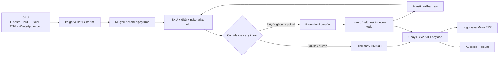

# Ürün ve Çözüm Kolu

> **Kural:** P1/P2/D1 geçmeden tam ürün yapılmaz. İlk ürün, yaşayan ERP'nin önünde çalışan güvenli bir shadow/exception katmanıdır.

[← Ana karar ağacı](index.md)

## 1. İlk ürün paketi

> “Yurt dışındaki AI order-entry kategorisini Türkiye'ye getirmiyoruz. Logo/Mikro kullanan teknik distribütörün yoğun sipariş anında PDF, Excel, e-posta ve WhatsApp'tan gelen siparişlerini; yerel SKU eş anlamları, paket birimi kuralları ve insan onaylı ERP aktarımıyla işliyoruz.”

### En fazla üç teslimat

1. **Çok kanallı sipariş satırı çıkarımı**  
   E-posta gövdesi, PDF, Excel/CSV ve kontrollü WhatsApp export'undan müşteri, ürün açıklaması/kodu, miktar, birim, fiyat ve teslimat notu çıkarılır.

2. **Müşteri–SKU eşleştirme ve exception kuyruğu**  
   Müşterinin kendi kodu, serbest metin ürün adı, ölçü, koli–adet–paket dönüşümü ve geçmiş siparişler şirket SKU'suyla eşleştirilir. Düşük güvenli veya çelişkili satır otomatik geçmez.

3. **İnsan onaylı ERP çıktısı ve audit log**  
   İlk aşamada onaylı CSV/import dosyası; teknik ve ekonomik kapılar geçerse kontrollü API writeback. Her alanın kaynağı, düzeltmesi ve onaylayanı kaydedilir.

## 2. Bilinçli olarak yapılmayacaklar

- Yeni ERP veya muhasebe sistemi
- Genel bayi portalı
- CRM
- Stok optimizasyonu
- Dinamik/otomatik fiyat değiştirme
- Müşteri chatbot'u
- Tam otonom sipariş kabulü
- Canlı WhatsApp Business entegrasyonu — veri/kanal kanıtı çıkana kadar
- Genel doküman yönetimi
- Her sektöre açık “AI belge işleme” platformu
- Logo, isim, marka çalışması ve ürün sitesi — karar kapısı açmıyorsa

## 3. İlk veri akışı

## 4. Shadow mode tasarımı

İlk pilotta sistem:

- canlı siparişi tek başına kabul etmez,
- ERP'ye otomatik kayıt açmaz,
- fiyat/iskonto değiştirmez,
- müşteriye otomatik mesaj göndermez,
- çalışan işlemiyle paralel çalışır,
- öneri ve kaynak gösterir,
- onaylı import dosyası üretir.

Bu tasarım Ü1'i güvenli biçimde ölçer: sistem önerisi ile gerçek çalışan girişi karşılaştırılır. Ü1 geçmeden API writeback yapılmaz.

## 5. Alanlar ve doğruluk sınıfları

| Alan | Kritik mi? | İlk eşik | Hata olduğunda davranış |
|---|---:|---:|---|
| Müşteri hesabı | Evet | ≥%99 | Otomatik geçmez; manuel seçim |
| Ürün/SKU | Evet | ≥%98 | Exception; kaynak metin ve ilk üç aday |
| Miktar | Evet | ≥%99 | Exception; belge satırı gösterilir |
| Birim/paket | Evet | ≥%99 | Koli–adet dönüşümü onaysız yapılmaz |
| Fiyat/iskonto | Evet | İlk pilotta yalnız okuma/karşılaştırma | Değişiklik yapmaz; ERP kuralına bırakır |
| Teslimat tarihi/notu | Orta | ≥%95 | Kullanıcı onayı |
| Serbest not | Düşük | Bilgi olarak taşınır | Otomatik karar üretmez |

**Kritik hata oranı**, ürün/SKU, müşteri, miktar, birim veya fiyatın yanlış fakat onaylanmış çıktıya dönüşmesidir. Hedef <%2; ideal sıfıra yakın. Düşük confidence satırın exception'a düşmesi hata değil, operasyon maliyetidir.

## 6. Alias ve dikey hafıza

Savunma hattı temel model değildir; tekrar kullanılan yerel ilişkidir:

- müşterinin ürün kodu ↔ distribütör SKU,
- serbest metin ↔ teknik ürün ailesi,
- ölçü/varyant ↔ SKU,
- koli/paket/adet dönüşümü,
- müşteriye özgü alışılmış birim,
- belge şablonu,
- geçmiş düzeltme ve exception nedeni,
- ERP alan eşleştirmesi.

Her düzeltme yalnız ilgili müşteriye uygulanmamalı; güvenli olduğunda sektör ortak sözlüğüne aday olarak yükseltilmelidir. Müşteri verisi başka müşteriye sızdırılmaz.

## 7. ERP entegrasyon dalları

### Mikro

Mikro'nun resmî API sitesi REST/JSON temelleri, üçüncü taraf geliştirici başvurusu, Postman koleksiyonları ve kayıt endpoint'leri sunuyor. “Verilen Teklif” gibi kayıt işlemleri için POST endpoint'leri yayımlanmış durumda. Bu, teknik olanak sinyalidir; müşterinin lisansı, sürümü, yetkisi ve sipariş evrak türü ayrıca doğrulanmalıdır.

- [Mikro API ana dokümantasyonu](https://apidocs.mikro.com.tr/)
- [Mikro API — Verilen Teklif](https://apidocs.mikro.com.tr/apis/verilen-teklif)

### Logo

Logo, üçüncü taraf yazılımların Logo çözümlerine entegre edilebildiğini ve veri toplama/entegrasyon çözümünün ERP ile çift yönlü veri paylaşımı yaptığını belirtiyor. Bu, “entegrasyon mümkün” yön sinyalidir; açık/public endpoint veya her ürün sürümünde aynı yöntem olduğu varsayılmayacaktır.

- [Logo — Özelleştirme ve Entegrasyon](https://www.logo.com.tr/dijital-donusum-hizmetleri/ozellestirme-ve-entegrasyon)
- [Logo — Veri Toplama ve Entegrasyon](https://www.logo.com.tr/urun/logo-veri-toplama-ve-entegrasyon-cozumu)

### Karar kapısı Ü2

| Sonuç | Açılan dal |
|---|---|
| Güvenli API ve yetki var | Kontrollü writeback; önce test firma/veritabanı, sonra insan onayı |
| API yok ama standart import var | CSV/import ürünü; ERP'yi otomatik açmadan değer teslim edilir |
| Bayi/entegratör zorunlu | Revenue-share veya entegrasyon ücretiyle partner dalı |
| Sürüm başına tamamen özel geliştirme | Tek ERP/ürün sürümüne daralt veya ürünleşmiş hizmet olarak fiyatla |
| Güvenli import yolu yok | Ü2 başarısız; yalnız diagnostic ekonomik değilse tez öldür |

## 8. KVKK ve veri güvenliği

Sipariş belgeleri şirket, çalışan ve müşteri iletişim bilgileri içerebilir. İlk tasarımda:

- veri minimizasyonu,
- kişisel alan maskeleme,
- müşteri bazlı izolasyon,
- saklama süresi ve silme politikası,
- rol bazlı erişim,
- audit log,
- test verisi ile üretim verisi ayrımı,
- yabancı modele gönderilen alanların kaydı,
- DPA/veri işleyen sözleşmesi,
- mümkünse yerel/VPC veya yerinde işlem seçeneği

bulunmalıdır.

KVKK'nın yurt dışına aktarım rejimi 1 Haziran 2024'te değişti. Standart sözleşmeler ve bağlayıcı şirket kuralları uygun güvence yöntemleri arasındadır; standart sözleşmenin imzadan itibaren beş iş günü içinde Kuruma bildirilmesi gerekir. 21 Temmuz 2026 duyurusu, yetkili imza, Türkçe metin, temsil belgeleri ve sözleşme metnini değiştirmeme gibi uygulama ayrıntılarını vurgular.

- [KVKK — Yurt dışına aktarım](https://www.kvkk.gov.tr/Icerik/2053/Yurtdisina-Aktarim)
- [KVKK — Standart sözleşmeler](https://www.kvkk.gov.tr/Icerik/7929/Standart-Sozlesmeler)
- [KVKK — 21 Temmuz 2026 kamuoyu duyurusu](https://www.kvkk.gov.tr/Icerik/8170/Yurt-Disina-Kisisel-Veri-Aktariminda-Kullanilacak-Standart-Sozlesmelerde-Dikkat-Edilmesi-Gereken-Hususlara-Iliskin-Kamuoyu-Duyurusu)

!!! warning "Hukuki sınır"
    Bu sayfa hukuki görüş değildir. Ücretli pilot öncesi veri rolleri, aktarım yolu, saklama ve sözleşme bir KVKK uzmanı/hukukçu tarafından müşteri bağlamında gözden geçirilmelidir.

## 9. Çalışan bypass'ı ve güç riski

Ürünü günlük kullanan kişi ile bütçeyi veren kişi farklıdır. Kıdemli çalışan:

- sipariş bilgisini kişisel güç olarak görebilir,
- sistemi iş kaybı veya gözetim olarak algılayabilir,
- telefon siparişini sisteme sokmayabilir,
- düzeltmeyi kaydetmeden manuel devam edebilir.

Patch:

- pilot tek inbox ile sınırlanır,
- süreç sahibi yönetim tarafından atanır,
- çalışan performans puanı üretilmez,
- düzeltme nedeni ürün kalitesi için tutulur, gizli gözetim için değil,
- çalışan “onaylayan uzman” olarak konumlanır,
- bypass sayısı ölçülür.

## 10. Etik kullanım katmanları

| Seviye | Örnek | Kısıt |
|---|---|---|
| Meşru ve agresif | Hata yakalama, hızlı veri girişi, stok/fiyat çelişkisini uyarma | Kaynak göster, onay al, logla |
| Gri alan | Siparişleri müşterinin kârlılığına göre görünmez önceliklendirme; çalışan davranış analizi | Şeffaf politika ve ayrı onay olmadan yapılmaz |
| Kırmızı alan | Onaysız fiyat değişimi, sipariş uydurma, sahte kıtlık, gizli çalışan gözetimi, müşteriler arası veri kullanımı | Teknik olarak engellenir; rol ve tenant izolasyonu |

## 11. Ürün karar kapıları

### Ü1 — Shadow benchmark

**Başarı:**

- ≥100 gerçek satır,
- satır doğruluğu ≥%90,
- hızlı onay ≥%70,
- kritik hata <%2,
- işlem süresi ≥%60 azalır.

**Kısmi sonuç:** Extraction iyi fakat fiyat/stok/teklif doğrulama ana darboğazsa **quote/order validation** dalı açılır.

**Başarısızlık:** İnsan gözetimiyle bile kritik hata eşiği geçilmiyor veya satırların >%50'si sürekli yorum gerektiriyorsa order-entry tezi öldürülür.

### Ü2 — Writeback

Ü1 ve ödeme kanıtı geçmeden açılmaz. Öncelik sırası:

1. Onaylı CSV/import,
2. test veritabanında API,
3. insan onaylı canlı writeback,
4. yalnız kanıtlanırsa daha fazla otomasyon.

### O1 — Tekrarlanabilirlik

İkinci müşteride:

- kod/kuralın ≥%70'i yeniden kullanılmalı,
- onboarding ≤10 iş günü olmalı,
- kurucu günlük manuel operatöre dönüşmemeli,
- müşteri başına yeni özel modül gerekmemeli.

Kısmi başarıda iş “ürünleşmiş hizmet” olarak premium fiyatla tek dikeyde tutulabilir. Başarısızlıkta ölçeklenebilir startup tezi kapanır.
