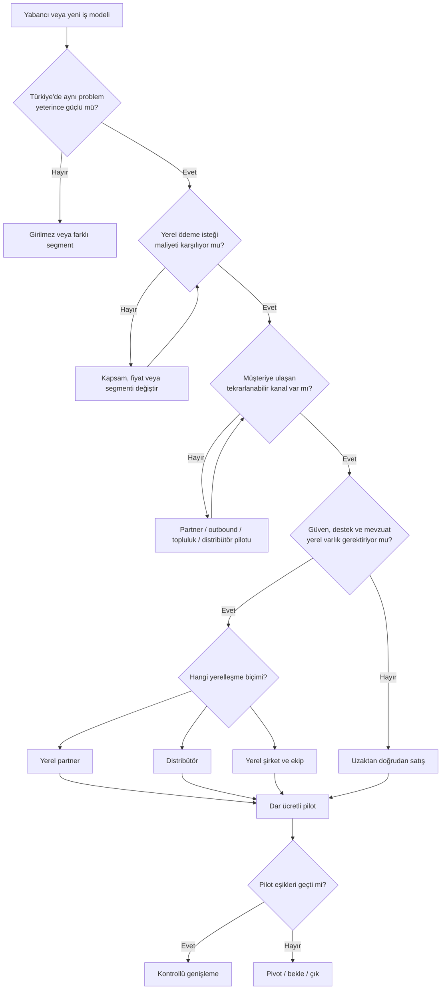

# Türkiye'ye Giriş

Bu dal, startup'ın Türkiye pazarına giriş biçimini seçmek için kullanılır. Genel “Türkiye büyük pazar mı?” sorusu yerine şu soruya cevap verir:

> Belirli bir müşteri segmentine, belirli bir teklif ve dağıtım kanalıyla, sürdürülebilir ekonomi içinde girebilir miyiz?

## Giriş karar ağacı

## İncelenecek katmanlar

| Katman | Cevaplanacak pratik soru |
|---|---|
| Müşteri | İlk ödeme yapacak dar segment kim? |
| Problem | Bugünkü çözümün para, zaman veya risk maliyeti ne? |
| Fiyat | TL fiyatı, kur ve vergi sonrası hâlâ cazip mi? |
| Dağıtım | İlk 10 ve ilk 100 müşteriye hangi kanalla ulaşılır? |
| Güven | Yerel marka, referans, destek veya yüz yüze satış gerekiyor mu? |
| Mevzuat | Lisans, veri, tüketici, sektör ve vergi engelleri neler? |
| Operasyon | Teslimat, tahsilat ve destek kimin üzerinden yürür? |
| Ekonomi | Müşteri edinme, teslim ve destek sonrası brüt katkı pozitif mi? |

## Karar çıktısı

Her Türkiye'ye giriş analizi dört karardan **yalnızca biriyle** kapanmalıdır:

- **Girilir:** Dar segment, kanal, teklif ve pilot planı bellidir.
- **Koşullu girilir:** Tek bir kritik varsayım önce test edilmelidir.
- **Beklenir:** Potansiyel vardır; fakat zamanlama, mevzuat veya ekonomi uygun değildir.
- **Girilmez:** Ödeme isteği, dağıtım veya yerel avantaj sürdürülebilir değildir.

## Ücretli pilot standardı

!!! success "Pilot, deneme değil karar aracıdır"
    Pilotun başlangıcında süre, müşteri sayısı, fiyat, başarı metriği, operasyon maliyeti ve devam kararı yazılmalıdır.

| Alan | Değer |
|---|---|
| Hedef segment | _Doldurulacak_ |
| Teklif | _Doldurulacak_ |
| Kanal | _Doldurulacak_ |
| Pilot süresi | _Doldurulacak_ |
| Başarı metriği | _Doldurulacak_ |
| Minimum eşik | _Doldurulacak_ |
| Pilot maliyeti | _Doldurulacak_ |
| Devam kararı | _Doldurulacak_ |
