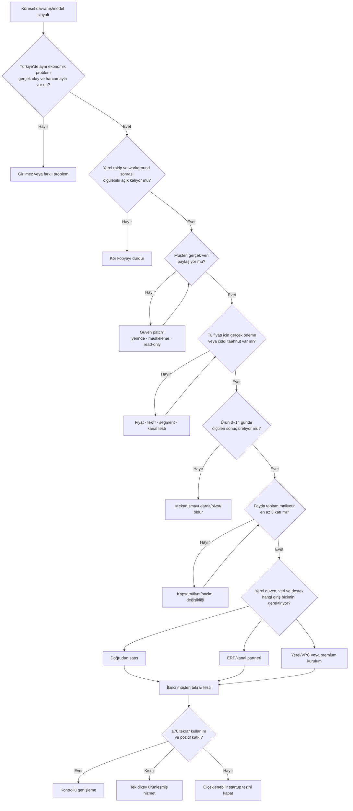

# Türkiye'ye Giriş

Bu dal, yabancı veya yeni bir iş modelinin Türkiye'de belirli bir müşteri, teklif, dağıtım kanalı ve sürdürülebilir ekonomiyle kurulup kurulamayacağını değerlendirir.

> “Türkiye'de yok” olumlu sinyal değildir. Yerli ürün, çalışan, danışman, ERP, Excel, WhatsApp ve hiçbir şey yapmamak birlikte gerçek rekabeti oluşturur.

## Aktif Türkiye giriş kararı

### Sipariş Operasyon Copilot'u — koşullu girilir

Yabancı order-entry kategorisinin arayüzü kopyalanmayacak. Logo veya Mikro kullanan, yüksek hacimli teknik distribütörün PDF, Excel, e-posta ve WhatsApp siparişleri; müşteri–SKU alias verisi, paket kuralları, confidence tabanlı exception kuyruğu ve insan onaylı ERP aktarımıyla işlenecek.

**Aktif kapı:** Müşterinin gerçek dosyayı paylaşması ve ölçülen değer için en az 20.000 TL ücretli taahhüt vermesi.

[Ana karar ağacını aç](siparis-operasyon-copilotu/index.md){ .md-button .md-button--primary }

## Neden koşullu?

| Katman | Mevcut hüküm |
|---|---|
| Problem | Türkiye'de sipariş/operasyon personeli ve manuel ERP aktarımı gerçek; fakat hedef fenotipte hacim ve ekonomik kayıp saha dosyasıyla ölçülmedi |
| Yerel boşluk | Gerçek boşluk değil. ArisaiSoft, ERP entegratörleri, bayi portalları ve çalışan emeği mevcut. Fırsat ancak dar dikey ve ölçülen sonuçla oluşabilir |
| Teknoloji | Belge çıkarımı ve SKU eşleştirme mümkün; Mikro resmî API, Logo üçüncü taraf entegrasyon altyapısı sunuyor. Müşteri sürümü/lisansı bilinmiyor |
| Dağıtım | HVAC/teknik çevre, ERP bayileri ve İstanbul teknik ticaret kümeleri erişilebilir; dönüşüm henüz kanıtlanmadı |
| Ekonomi | 20–25 bin TL diagnostic ve 45 bin TL shadow pilot test fiyatıdır; ödeme ve ≥3x fayda doğrulanmadı |
| Veri/mevzuat | Shadow mode ve veri minimizasyonu riski azaltır; KVKK rolleri ve varsa yurt dışı aktarım mekanizması müşteri bazında çözülmeli |
| Kurucu uyumu | Python, veri, LLM, API ve hızlı prototipleme uyumu yüksek; Logo/Mikro ve sektör ürün dili öğrenilmesi gerekiyor |

## Giriş karar ağacı

## Türkiye'ye özgü kama

Kama yalnız Türkçe veya düşük fiyat değildir:

1. **Yerel sistem:** Logo/Mikro import ve entegrasyon şablonları.
2. **Yerel işlem dili:** müşteri ürün kodları, teknik kısaltmalar, ölçü ve paket birimleri.
3. **Mevcut kanal:** müşteriyi yeni portala zorlamadan e-posta/PDF/Excel/WhatsApp girdisi.
4. **Dikey veri hendeği:** alias, exception ve düzeltme hafızası.
5. **Güvenli operasyon:** human-in-the-loop, kaynak gösterimi, audit log ve shadow mode.
6. **Dağıtım:** ERP bayisi ve teknik ticaret ağı.
7. **Sonuç fiyatlaması:** süre, hata, kapasite ve doğrulanmış ekonomik etki.

## Türkiye'de gerçek alternatifler

- İç satış veya sipariş operasyon çalışanı
- Şirket sahibinin veya satışçının takibi
- Telefon, WhatsApp, e-posta ve Excel
- Bayi portalı/B2B sipariş sitesi
- Logo/Mikro modülleri
- ERP entegratörü veya yerel özel yazılım
- ArisaiSoft benzeri AI belge işleme çözümleri
- Hiçbir şey yapmamak

Yeni ürün bu bütçelerden birini değiştirmiyorsa yeni ve zayıf bir bütçe yaratmak zorundadır.

## Yerel doğrulama kaynakları

- [ArisaiSoft — AI document processing ve ERP aktarımı](https://arisaisoft.com/)
- [Mikro API dokümantasyonu](https://apidocs.mikro.com.tr/)
- [Logo — Özelleştirme ve Entegrasyon](https://www.logo.com.tr/dijital-donusum-hizmetleri/ozellestirme-ve-entegrasyon)
- [Logo — Veri Toplama ve Entegrasyon](https://www.logo.com.tr/urun/logo-veri-toplama-ve-entegrasyon-cozumu)
- [KVKK — Yurt dışına aktarım](https://www.kvkk.gov.tr/Icerik/2053/Yurtdisina-Aktarim)
- [KVKK — 21 Temmuz 2026 standart sözleşme duyurusu](https://www.kvkk.gov.tr/Icerik/8170/Yurt-Disina-Kisisel-Veri-Aktariminda-Kullanilacak-Standart-Sozlesmelerde-Dikkat-Edilmesi-Gereken-Hususlara-Iliskin-Kamuoyu-Duyurusu)

## Karar sınıfları

- **Girilir:** Dar segment, veri, ödeme, sonuç, kanal ve ekonomi kapıları geçmiştir.
- **Koşullu girilir:** Tek veya birkaç açık kritik kapı saha deneyiyle test edilmektedir.
- **Beklenir:** Problem vardır; uzman, veri, mevzuat veya zamanlama eksiktir.
- **Girilmez:** Ödeme, dağıtım, yerel avantaj veya ekonomi sürdürülebilir değildir.

Sipariş operasyon copilot'u şu anda **koşullu girilir** durumundadır. Ana kararı değiştirecek kanıt yalnız gerçek dosya, ölçülen sonuç ve ücretli taahhüttür.

## Ayrıntılı sayfalar

- [Pazar ve müşteri](siparis-operasyon-copilotu/pazar.md)
- [Ürün ve çözüm](siparis-operasyon-copilotu/urun.md)
- [Dağıtım ve satış](siparis-operasyon-copilotu/satis.md)
- [Ekonomi](siparis-operasyon-copilotu/ekonomi.md)
- [Deneyler](siparis-operasyon-copilotu/deneyler.md)
- [Karar günlüğü](siparis-operasyon-copilotu/karar-gunlugu.md)
- [Küresel sinyal ve Türkiye kanıt radarı](siparis-operasyon-copilotu/kanit-radari.md)
